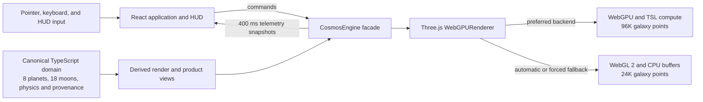

<div align="center">
  <a href="https://space-engine-web.vercel.app/" aria-label="Open Astral Surveyor">
    
  </a>

  <h1>Astral Surveyor</h1>

  <p><strong>A clean-room WebGPU universe explorer built with React, TypeScript, and Three.js.</strong></p>
  <p>Explore a deterministic prototype star system, inspect procedural worlds, accelerate simulation time, and fall back gracefully to WebGL 2 when WebGPU is unavailable.</p>

  <p>
    <a href="https://space-engine-web.vercel.app/"></a>
    <a href="https://github.com/tianrking/SpaceEngine-Web"></a>
    <a href="https://github.com/tianrking/SpaceEngine-Web/actions/workflows/ci.yml"></a>
  </p>
</div>

<p align="center">
  <a href="https://space-engine-web.vercel.app/">
    
  </a>
</p>

## Overview

Astral Surveyor is a browser-based vertical slice for testing the engineering foundations of a large-scale universe explorer. The current application renders a deliberately compressed, visual-scale version of the fictional Asteria system. It combines a GPU-initialized spiral starfield, eight planets, eighteen parent-relative moons, procedural surfaces, rings, cloud shells, atmospheric presentation, a cinematic scientific HUD, and live renderer telemetry.

The renderer and product UI now consume the same deterministic domain catalogue. That single source owns f64 Kepler mechanics, nested orbital hierarchy, SI inputs, equation-derived physical measurements, astronomical units, seeded procedural properties, provenance, and high/low precision helpers.

This project is an original clean-room implementation. It is not a port, fork, or web edition of SpaceEngine.

## Technology stack

<p align="center">
  
  
  
  
  
  
  
</p>

| Layer | Technology | Role in this repository |
| --- | --- | --- |
| Interface | React 19, Lucide React, CSS | HUD, object inspector, system navigator, time controls, quality presets, and responsive overlays |
| Language | TypeScript 6 | Typed engine contracts, simulation-domain code, UI, and build-time checks |
| Rendering | Three.js r185 `WebGPURenderer` | Scene graph, node materials, logarithmic depth, WebGPU selection, and WebGL 2 fallback |
| GPU programs | Three.js Shading Language (TSL) | WebGPU compute initialization for the spiral starfield and backend-compatible node materials |
| Procedural visuals | `simplex-noise`, Canvas textures | Seeded planet albedo, clouds, glows, rings, and small rocky-surface displacement |
| State boundary | React state plus engine snapshots | Commands flow into `CosmosEngine`; telemetry returns to React every 400 ms rather than every frame |
| Tooling | Vite 8, Oxlint | Development server, optimized production build, and static analysis |
| Tests | Vitest 4 | Deterministic catalogue, RNG, units, orbital mechanics, and precision-helper tests |
| Delivery | GitHub Actions, Vercel | `Quality Gate` CI and static Vite deployment |

WebAssembly is not currently used. The project first establishes correctness in TypeScript/f64 and will only move measured CPU hot paths to Rust/WASM if profiling justifies the added boundary and deployment complexity.

## Feature highlights

- **WebGPU-first rendering.** Three.js selects the WebGPU backend when available and initializes 96,000 spiral-galaxy points with a TSL compute pass.
- **Honest WebGL 2 fallback.** Unsupported or explicitly downgraded clients receive a 24,000-point CPU-generated galaxy while keeping the main navigation and inspection experience.
- **Seeded visual scene.** An additional 8,000 far stars and the procedural texture generators use repeatable pseudo-random sequences.
- **Interactive Asteria system.** Explore one G-class star, eight primary worlds, and eighteen selectable moons spanning lava, desert, ocean, super-Earth, Neptunian, gas-giant, ice-giant, dwarf, volcanic, rocky, icy, and oceanic classes.
- **Physics-derived catalogue.** Density, reference gravity, escape velocity, orbital period, mean orbital speed, periapsis, apoapsis, stellar flux, and equilibrium temperature are calculated from SI catalogue inputs instead of being independently hand-typed display values.
- **Hierarchical orbital simulation.** Planets follow deterministic Keplerian ellipses around Asteria; moons follow parent-relative orbits that are transformed into the star-system frame. Simulation time can pause or advance from `0.25x` to `10,000x` through the HUD.
- **Precision foundations.** The renderer recenters its floating origin beyond a fixed threshold. Separate, unit-tested high/low helpers are ready for future shader integration.
- **Procedural presentation.** Planets and moons include generated textures, class-aware terrain displacement, pressure-scaled atmosphere shells, cloud layers, ring geometry, stellar glow, and ACES filmic tone mapping.
- **Working product tools.** Search and filter all 27 bodies, inspect satellite families in the system map, save any destination locally, inspect the scientific/runtime model, and open an accessible keyboard guide.
- **Product-grade scientific HUD.** Switch between Overview, Physics, and Orbit tabs; inspect bulk properties, climate assumptions, atmospheric composition, conservative environment labels, provenance, and the live render pipeline.

## Scientific model and provenance

Astral Surveyor's Asteria system is **fictional and deterministic**, not an observed exoplanet catalogue. Every body exposes provenance so curated scenario assumptions are distinguishable from equation-derived measurements.

- Reference conversions use the [IAU 2015 Resolution B3 nominal constants](https://www.iau.org/common/Uploaded%20files/IAUGA2015-Resolution-B3-recommended-nominal-conversion.pdf).
- World classes follow the broad terminology used by [NASA Exoplanet Exploration](https://science.nasa.gov/exoplanets/planet-types/).
- Internal values use SI units and JavaScript `number`/f64 precision.
- Climate and habitability labels are conservative exploration heuristics, not biosignature detections.
- Visual radii and orbital distances are compressed independently from the physical catalogue.

The equations, assumptions, input/derived boundary, and limitations are documented in [the scientific model](docs/SCIENCE_MODEL.md).

## Current capability boundaries

The prototype is intentionally narrower than a production astronomical simulator.

| Area | What works now | Not implemented yet |
| --- | --- | --- |
| Scale | Floating-origin recentering and logarithmic depth in a compressed visual system | Physically scaled travel from planetary terrain to interstellar or galactic distances |
| Coordinates | f64 domain values, parent-relative moon transforms, and tested high/low split utilities | High/low shader integration, hierarchical galaxy/system/planet reference frames, or catalogue-grade observed sky coordinates |
| Terrain | Fixed sphere meshes, seeded textures, and small CPU vertex displacement | Cube-sphere quadtree LOD, tile scheduling, geomorphing, collision, walking, or terrain-level landing |
| Atmosphere | Transparent additive shells and animated cloud presentation | Rayleigh/Mie scattering, precomputed atmosphere LUTs, volumetric clouds, weather, or physically based eclipses |
| Physics | Equation-derived bulk properties, stellar environment, and elliptic two-body Kepler motion | N-body gravity, perturbations, resonances, tidal evolution, relativistic trajectories, spacecraft dynamics, or aerodynamics |
| Data | Fictional deterministic Asteria inputs, explicit synthetic provenance, and derived measurements | Gaia/HYG ingestion, authoritative ephemerides, observed atmospheres/terrain, or uncertainty propagation |
| Universe generation | Seeded catalogue/RNG modules and on-demand procedural visual textures | Persistent sectors, billions of addressable objects, streaming catalogues, or generator-version migrations |
| Product UI | Inspector, system list, local catalogue search, schematic star map, `localStorage` saved places with memory fallback, runtime settings, shortcut guide, quality, cinematic, and time controls | Cross-system search, cloud sync, shared locations, user accounts, or server persistence |
| Platform resilience | Automatic WebGL 2 fallback and an explicit fallback test route | GPU device-loss recovery, offline application caching, browser E2E coverage, or formal performance budgets |

The catalogue is a physically constrained fictional scenario. Its derived values are internally consistent with the documented inputs, but they are not telescope observations. Visual radii and orbital distances are compressed for readability and must not be interpreted as a 1:1 scale model.

## Controls

| Input | Action |
| --- | --- |
| Left-drag | Orbit around the current control target |
| Mouse wheel | Dolly toward or away from the target |
| Click a star, planet, moon, or ring | Select it and open its inspector |
| Double-click a star, planet, or moon | Fly to its orbital view |
| `G` | Focus the currently selected target |
| `/` | Open and focus the Asteria catalogue search |
| `?` | Open the keyboard shortcut guide |
| `Esc` | Close the active panel or dialog and return to Explore |
| `W` / `S` | Fly forward / backward |
| `A` / `D` | Fly left / right |
| `Q` / `E` | Fly down / up |
| Hold `Shift` | Apply a 4x keyboard-flight boost |
| `Space` | Pause or resume simulation time |
| **Go to orbit** | Fly to the selected body |
| **Close approach** | Move closer to the selected planet; this is not terrain landing |
| **Observation deck** | Reset the camera to the initial system view |
| Navigation rail | Open Explore, Search, Star map, Saved places, or Settings |
| Time transport controls | Pause, resume, change the positive time scale, or reset the epoch |
| Quality selector | Switch between Performance, Balanced, and Ultra render resolution |
| Aperture button | Toggle cinematic mode and hide interface chrome |

## Quick start

### Prerequisites

- Node.js **22.12 or newer** is recommended; CI currently uses Node.js 22.
- A current browser with hardware acceleration. WebGPU is preferred; WebGL 2 is the compatibility path.
- `localhost` is accepted as a secure context for WebGPU. Public deployments must use HTTPS.

```bash
git clone https://github.com/tianrking/SpaceEngine-Web.git
cd SpaceEngine-Web
npm ci
npm run dev
```

Open the URL printed by Vite, normally <http://localhost:5173/>.

To exercise the fallback path explicitly, append `?renderer=webgl2`:

```text
http://localhost:5173/?renderer=webgl2
```

## Available scripts

| Command | Purpose |
| --- | --- |
| `npm run dev` | Start the Vite development server with hot module replacement |
| `npm run build` | Type-check project references and create the production bundle in `dist/` |
| `npm run preview` | Serve the existing production bundle locally, normally on port 4173 |
| `npm run lint` | Run Oxlint across the project |
| `npm run test` | Run the Vitest unit suite once |
| `npm run check` | Run lint, tests, and the production build in sequence |

## Architecture



The Three.js animation loop owns camera motion, hierarchical orbital updates, GPU resources, and per-frame rendering. React receives low-frequency snapshots for presentation, keeping reconciliation out of the render hot path. The DOM-free domain layer feeds both renderer and UI views and can later run in a Worker or become a WASM candidate without coupling simulation rules to React.

For deeper design notes, see [Architecture](docs/ARCHITECTURE.md) and [Research](docs/RESEARCH.md).

## Repository layout

```text
.
├── .github/workflows/ci.yml   # Quality Gate: npm ci + npm run check
├── docs/
│   ├── assets/                # README and product media
│   ├── ARCHITECTURE.md        # Engine boundaries and future terrain design
│   ├── SCIENCE_MODEL.md       # Inputs, derived equations, provenance, and limitations
│   └── RESEARCH.md            # Source-grounded SpaceEngine/WebGPU research
├── public/                    # Favicon, manifest, robots, and sitemap metadata
├── src/
│   ├── components/            # Navigator, product tools, saved places, and shortcut dialog
│   ├── domain/                # Canonical catalogue, physics, f64 orbits, RNG, units, precision
│   ├── engine/                # Three.js renderer, domain adapters, procedural textures
│   ├── ui/                    # Reusable HUD components and styles
│   ├── App.tsx                # UI-to-engine orchestration
│   └── main.tsx               # React entry point
├── index.html                 # Vite document and SEO metadata
├── package.json               # Dependencies and scripts
└── vite.config.ts             # Vite React configuration
```

## WebGPU and WebGL 2 fallback

`CosmosEngine` constructs Three.js `WebGPURenderer` with antialiasing and a logarithmic depth buffer. At startup, Three.js attempts WebGPU first and uses its WebGL 2 backend when WebGPU cannot be initialized. The app reports the actual backend in the top status bar rather than inferring support from `navigator.gpu` alone.

| Mode | How to activate | Current star budget | Generation path |
| --- | --- | --- | --- |
| WebGPU | Default on a supported secure-context browser | 104,000 total: 96,000 galaxy + 8,000 far stars | TSL compute initializes galaxy position/color storage, plus CPU-seeded far stars |
| WebGL 2 | Automatic fallback or `?renderer=webgl2` | 32,000 total: 24,000 galaxy + 8,000 far stars | CPU-generated typed arrays rendered through Three.js's WebGL 2 backend |

The fallback preserves the product flow, not feature/performance parity. WebGPU compute, adapter details, supported limits, and visual throughput vary by browser, operating system, driver, and GPU.

## Local production preview

Build the same optimized output deployed by Vercel, then serve it locally:

```bash
npm run build
npm run preview
```

Open <http://localhost:4173/> or the address printed by Vite. `npm run preview` does not rebuild automatically; rerun `npm run build` after source changes.

## Testing and verification

Run the full local quality gate before opening a pull request:

```bash
npm run check
```

The unit suite currently verifies:

- deterministic seeded RNG streams and independent forks;
- the eight-planet and eighteen-moon catalogue, rings, nested lookup, and provenance;
- density, gravity, escape velocity, orbital speed, radiative equilibrium, flux, and conservative environment derivations;
- elliptic Kepler solving, orbital state, period derivation, and epoch periodicity;
- astronomical distance/speed formatting; and
- camera-relative high/low precision splitting and reconstruction.

GitHub Actions runs `npm ci` followed by `npm run check` for pull requests and pushes to `main`.

Browser behavior still requires a manual two-backend smoke test:

1. Open the default URL and confirm either **WebGPU active** or an honest **WebGL fallback** status.
2. Select and focus several bodies; verify orbit controls, keyboard flight, time controls, and telemetry.
3. Open `?renderer=webgl2` and confirm **WebGL fallback**, **CPU fallback**, and the reduced `32K` star count.
4. Check the console for shader, resource, and initialization errors.

There is no automated browser E2E or GPU performance test suite yet; Vitest passing is not evidence of cross-device rendering correctness.

## Deploy to Vercel

### One click

[](https://vercel.com/new/clone?repository-url=https%3A%2F%2Fgithub.com%2Ftianrking%2FSpaceEngine-Web)

Vercel detects the Vite project automatically. The current application has no required environment variables; the production build command is `npm run build` and the output directory is `dist`.

### Vercel CLI

```bash
npm ci
npx vercel
```

Accept the detected Vite defaults for a preview deployment. When the preview is verified, create a production deployment with:

```bash
npx vercel --prod
```

The public deployment for this repository is <https://space-engine-web.vercel.app/>.

## Roadmap

- [x] WebGPU-first Three.js renderer with an explicit WebGL 2 fallback
- [x] GPU-initialized galaxy, seeded far stars, procedural planets, clouds, and rings
- [x] Visual Asteria navigation, object inspection, time controls, and telemetry
- [x] Local search, schematic star map, saved places, runtime settings, and shortcut help
- [x] Deterministic f64 domain catalogue, Kepler mechanics, RNG, units, and precision tests
- [x] Drive renderer, search, map, and scientific Inspector from one canonical domain catalogue
- [x] Render selectable parent-relative moons and derive their physical/orbital profiles
- [ ] Add hierarchical coordinate frames and use high/low values in render shaders
- [ ] Build six-face cube-sphere quadtree terrain with screen-space error, seams, and tile budgets
- [ ] Add a Worker-backed low-LOD terrain provider for WebGL 2
- [ ] Implement physically motivated atmospheric scattering and eclipse/ring shadows
- [ ] Add licensed catalogue streaming with provenance and generator-versioned persistence
- [ ] Add GPU device-loss recovery, browser E2E tests, and measurable performance budgets
- [ ] Evaluate Rust/WASM SIMD or threads only for profiled CPU bottlenecks

## Clean-room, trademark, and license notice

Astral Surveyor is an independent, original prototype. **SpaceEngine** is the name and trademark of its respective owner, Cosmographic Software LLC. This repository is not affiliated with, endorsed by, sponsored by, or derived from the SpaceEngine product. No SpaceEngine source code, shaders, proprietary assets, or internal data files are intentionally included.

The repository currently has **no `LICENSE` file**. Publication on GitHub does not by itself grant permission to use, copy, modify, or redistribute the code. Do not represent this project as MIT-licensed or otherwise open source unless and until the repository owner adds an explicit license.
