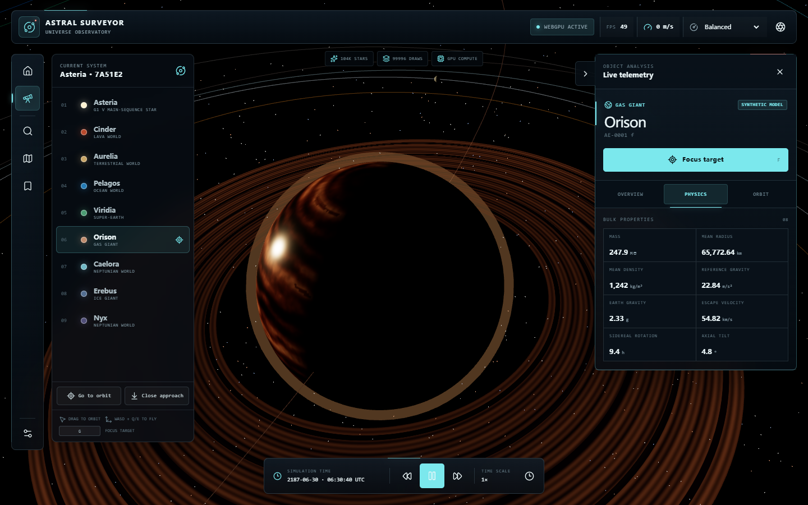
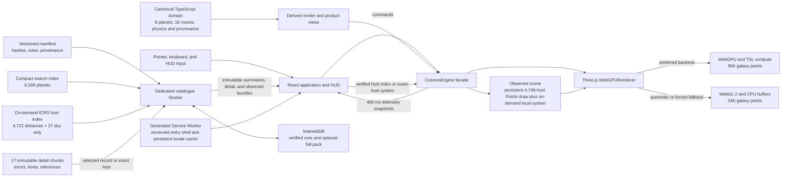

<div align="center">
  <a href="https://space-engine-web.vercel.app/" aria-label="Open Astral Surveyor">
    
  </a>

  <h1>Astral Surveyor</h1>

  <p><strong>A clean-room WebGPU universe explorer built with React, TypeScript, and Three.js.</strong></p>
  <p>Explore a deterministic procedural system, navigate a source-backed NASA host universe and its on-demand planetary systems, tune the visual observatory, and fall back gracefully to WebGL 2 when WebGPU is unavailable.</p>

  <p>
    <a href="https://space-engine-web.vercel.app/"></a>
    <a href="https://github.com/tianrking/SpaceEngine-Web"></a>
    <a href="https://github.com/tianrking/SpaceEngine-Web/actions/workflows/ci.yml"></a>
  </p>
</div>

<p align="center">
  <a href="https://space-engine-web.vercel.app/">
    
  </a>
</p>

## Overview

Astral Surveyor is a browser-based vertical slice for testing the engineering foundations of a large-scale universe explorer. The application renders a deliberately compressed, visual-scale version of the fictional Asteria system and pairs it with a source-backed, navigable catalogue of **6,336 confirmed exoplanets across 4,749 host systems**. It combines a GPU-initialized spiral starfield, eight Asteria planets, eighteen parent-relative moons, procedural surfaces, rings, cloud shells, atmospheric presentation, a cinematic scientific HUD, an interactive real-coordinate ICRS atlas, a single-draw 3D observed-host cloud, on-demand observed planetary systems, visual calibration, live renderer telemetry, and an installable verified offline research pack.

The renderer and product UI now consume the same deterministic domain catalogue. That single source owns f64 Kepler mechanics, nested orbital hierarchy, SI inputs, equation-derived physical measurements, astronomical units, seeded procedural properties, provenance, and high/low precision helpers.

This project is an original clean-room implementation. It is not a port, fork, or web edition of SpaceEngine.

## Technology stack

<p align="center">
  
  
  
  
  
  
  
  
</p>

| Layer | Technology | Role in this repository |
| --- | --- | --- |
| Interface | React 19, Lucide React, CSS | HUD, object inspector, system navigator, time controls, quality presets, and responsive overlays |
| Language | TypeScript 6 | Typed engine contracts, simulation-domain code, UI, and build-time checks |
| Internationalization | i18next 26, react-i18next 17, `Intl` | Typed authoring resources, generated per-locale packs, on-demand non-English loading, synchronized document metadata, and locale-aware values |
| Rendering | Three.js r185 `WebGPURenderer` | Scene graph, node materials, logarithmic depth, WebGPU selection, and WebGL 2 fallback |
| GPU programs | Three.js Shading Language (TSL) | WebGPU compute initialization for the spiral starfield and backend-compatible node materials |
| Procedural visuals | `simplex-noise`, Canvas textures | Seeded planet albedo, clouds, glows, rings, and small rocky-surface displacement |
| Astronomical data | NASA Exoplanet Archive TAP release | Versioned composite parameters for 6,336 confirmed exoplanets, a compact search index, a 4,749-host ICRS sky index, and 17 content-addressed scientific-detail chunks |
| Catalogue runtime | Dedicated Web Worker, Web Crypto, IndexedDB, immutable HTTP assets | Off-main-thread packed UTF-8 search, SHA-256/byte-size/schema verification, cancellable detail and exact-host system streams, bounded memory/disk caches, and an optional complete offline pack |
| Offline shell | Generated Service Worker | Content-versioned entry-shell precache, required-English locale precache, network-first navigation, and a persistent on-demand locale cache without intercepting catalogue release validation |
| State boundary | React state plus engine snapshots | Commands flow into `CosmosEngine`; telemetry returns to React every 400 ms rather than every frame |
| Tooling | Vite 8, Oxlint | Development server, optimized production build, and static analysis |
| Tests | Vitest 4 | Deterministic catalogue, RNG, units, orbital mechanics, and precision-helper tests |
| Delivery | GitHub Actions, Vercel | `Quality Gate` CI and static Vite deployment |

WebAssembly is not currently used. The project first establishes correctness in TypeScript/f64 and will only move measured CPU hot paths to Rust/WASM if profiling justifies the added boundary and deployment complexity.

## Feature highlights

- **WebGPU-first rendering.** Three.js selects the WebGPU backend when available and initializes 96,000 spiral-galaxy points with a TSL compute pass.
- **Honest WebGL 2 fallback.** Unsupported or explicitly downgraded clients receive a 24,000-point CPU-generated galaxy while keeping the main navigation and inspection experience.
- **Seeded visual scene.** An additional 8,000 far stars and the procedural texture generators use repeatable pseudo-random sequences.
- **Interactive Asteria system.** Explore one G-class star, eight primary worlds, and eighteen selectable moons spanning lava, desert, ocean, super-Earth, Neptunian, gas-giant, ice-giant, dwarf, volcanic, rocky, icy, and oceanic classes.
- **Physics-derived catalogue.** Density, reference gravity, escape velocity, orbital period, mean orbital speed, periapsis, apoapsis, stellar flux, and equilibrium temperature are calculated from SI catalogue inputs instead of being independently hand-typed display values.
- **Hierarchical orbital simulation.** Planets follow deterministic Keplerian ellipses around Asteria; moons follow parent-relative orbits that are transformed into the star-system frame. Simulation time can pause or advance from `0.25x` to `10,000x` through the HUD.
- **Body-centered camera frames.** Selecting an Asteria body and centering the camera are separate operations. Orbit supports its rendered star, planets, and moons; Close Approach supports non-stellar bodies. The camera and control target follow that body's world-space motion together, including at high simulation time scales, while preserving the user's relative viewing angle.
- **Reversible camera navigation.** Up to eight immediately previous views can be restored without assuming the star is at local origin. System overview is a reversible camera destination; the separate reset action clears view history and restores the initial product state.
- **Explicit free flight.** Cancelling an in-progress camera transition preserves the exact current pose and labels it as Free flight. It neither claims a system overview nor changes the selected body, and the interrupted destination remains available through Previous View.
- **Precision foundations.** The renderer recenters its floating origin beyond a fixed threshold. Separate, unit-tested high/low helpers are ready for future shader integration.
- **Procedural presentation.** Planets and moons include generated textures, class-aware terrain displacement, pressure-scaled atmosphere shells, cloud layers, ring geometry, stellar glow, and ACES filmic tone mapping.
- **Live visual observatory.** Tune tone-mapped exposure, orbital-guide brightness, and starfield brightness without rebuilding the scene or reallocating GPU geometry/material resources; versioned preferences persist locally.
- **Complete exoplanet archive.** Search all 6,336 confirmed planets in the pinned release by planet, host, spectral type, discovery method, or facility; combine Nearby, Earth-size, Temperate, and Recent filters and sort by name, distance, or discovery date.
- **Observed-host sky atlas.** Explore all 4,749 NASA host systems on an interactive high-DPI ICRS canvas using reported RA/Dec, distance, Gaia identity/magnitude, spectral type, multiplicity, and confirmed-planet count. Its 172 KiB gzip data asset and 3.3 KiB gzip UI chunk load only when requested; pointer and keyboard selection work, and composite-field conflicts remain visible instead of being resolved to a convenient value.
- **Navigable observed universe.** The same 4,749-host index renders as one GPU `THREE.Points` cloud. All directions use reported ICRS RA/Dec; 4,722 hosts with a reported distance receive monotonic logarithmic visual spacing and can open an observed system, while 27 distance-null hosts remain explicitly **sky-only** and can be located by direction without pretending that their depth is known.
- **Observed systems on demand.** Opening a distance-bearing host asks the verified Worker for that exact hostname and only the immutable detail chunks that contain its planets. The pinned release contains up to eight planets in one host system. The resulting star, planets, orbit guides, inspector data, and camera targets replace the current observed scene without reconstructing the renderer.
- **Honest observed-orbit presentation.** NASA archive-composite values, uncertainties, limits, references, conflicts, and `null` values remain inspectable. Longitude of ascending node, argument of periapsis, and orbital phase are absent from this release and therefore use deterministic, explicitly **illustrative** values for visualization; no generated orientation is presented as an observation.
- **Observed-object camera frames.** Selection and centering remain separate in both the host universe and an opened system. Hosts, stars, and planets support Orbit centering; observed planets additionally support Close view. Time-dependent observed planets keep moving from reported periods, and a completed centered frame follows the selected object's world-space motion without silently retargeting when another object is inspected.
- **Scientific detail on demand.** The initial catalogue transfer is a compact 175 KiB gzip search index, including precomputed distance and discovery orders. Expanding a result fetches only one 78–153 KiB gzip detail chunk containing measurements, asymmetric errors, limit flags, source references, external IDs, discovery equipment, spectra/JWST counts, and stellar context.
- **Measured 100k search architecture.** A deterministic, explicitly synthetic 100,000-summary fixture runs in CI. The Worker search core stores normalized text in one UTF-8 byte buffer with typed offsets/orders instead of duplicating 100,000 JavaScript object forests; exact identity/name and mixed-filter p95 are both required to remain below 50 ms, while the auxiliary index must remain below 24 MiB.
- **Honest runtime telemetry.** The research panel reports packed-index CPU time separately from end-to-end verified readiness, which also includes network or IndexedDB loading, byte/hash/schema checks, and offline-state inspection.
- **Explicit data integrity.** Every immutable asset is checked against manifest byte size and SHA-256 before use. Missing source values remain `null`, composite fields stay labelled, stale detail requests can be cancelled, and only two decoded chunks remain in Worker memory.
- **Bounded offline observatory.** The generated Service Worker precaches the HTML, directly referenced entry JavaScript/CSS, icon, localized manifests, and the required English pack so the default interface has an offline language fallback. It does not install-fetch Spanish, Traditional Chinese, French, the code-split `CosmosEngine`, NASA client/Worker/atlas chunks, or catalogue assets. Non-English locale requests are network-first and can reuse a previously cached pack when the network fails; the NASA Worker separately restores its verified search core from IndexedDB, and an explicit 17-chunk research pack adds all scientific details. Installing the entry shell therefore does not claim that every lazy feature or language is available offline.
- **Working product tools.** Search and filter all 27 bodies, inspect satellite families in the system map, save any destination locally, inspect the scientific/runtime model, and open an accessible keyboard guide.
- **Product-grade scientific HUD.** Switch between Overview, Physics, and Orbit tabs; inspect bulk properties, climate assumptions, atmospheric composition, conservative environment labels, provenance, and the live render pipeline.
- **Product-wide localization.** English is the deterministic default, with complete Spanish, Traditional Chinese, and French application chrome. Application bootstrap requests the active `/locales/<locale>.json` pack; optional non-English packs stay outside the initial transfer unless selected, while Service Worker installation separately caches English as the required offline fallback. Language changes are available before launch and in Settings, persist locally, synchronize across open tabs, and do not recreate the Three.js/WebGPU engine.

## Scientific model and provenance

Astral Surveyor keeps two intentionally separate scientific layers:

- The rendered Asteria system is **fictional and deterministic**. Every body exposes provenance so curated scenario assumptions are distinguishable from equation-derived measurements.
- The Nearby Worlds archive and observed 3D scenes consume **observational catalogue records** retrieved from the NASA Exoplanet Archive `pscomppars` table. These rows can combine preferred values from different literature sources, so the interface labels them **archive composite** and never presents missing values as measured facts.
- The observed renderer is a visual interpretation of that catalogue, not a complete orbital solution. Reported values stay observational; derived ICRS Cartesian positions are labelled derived; deterministic replacements for missing orientation or phase stay illustrative.

- Reference conversions use the [IAU 2015 Resolution B3 nominal constants](https://www.iau.org/common/Uploaded%20files/IAUGA2015-Resolution-B3-recommended-nominal-conversion.pdf).
- World classes follow the broad terminology used by [NASA Exoplanet Exploration](https://science.nasa.gov/exoplanets/planet-types/).
- Internal values use SI units and JavaScript `number`/f64 precision.
- Climate and habitability labels are conservative exploration heuristics, not biosignature detections.
- Visual radii and orbital distances are compressed independently from the physical catalogue.
- The checked-in NASA release contains 6,336 unique planets in 4,749 host systems. Its metadata preserves the exact TAP query, source URL, retrieval time, release identity, content hashes, chunk boundaries, selection rule, conflict policy, and null policy. The host atlas is a map of confirmed-planet discoveries, not a statistically complete stellar census.

The equations, assumptions, input/derived boundary, and limitations are documented in [the scientific model](docs/SCIENCE_MODEL.md). The path from this implemented progressive NASA release to Gaia/SIMBAD/IVOA cross-matching and 100,000-summary scale is documented in the [real-catalog expansion roadmap](docs/CATALOG_EXPANSION.md).

## Current capability boundaries

The prototype is intentionally narrower than a production astronomical simulator.

| Area | What works now | Not implemented yet |
| --- | --- | --- |
| Scale | Floating-origin recentering and logarithmic depth in compressed Asteria and observed scenes; the observed-host radius is a monotonic log transform of parsecs | Physically scaled travel from planetary terrain to interstellar or galactic distances |
| Coordinates | f64 domain values, parent-relative moon transforms, moving-object camera frames, tested high/low split utilities, and verified ICRS directions for all 4,749 NASA hosts; 4,722 use reported distance and 27 remain on a labelled sky-only shell | High/low shader integration, epoch propagation/proper-motion covariance, or hierarchical interstellar/galactic navigation frames |
| Terrain | Fixed sphere meshes, seeded textures, and small CPU vertex displacement | Cube-sphere quadtree LOD, tile scheduling, geomorphing, collision, walking, or terrain-level landing |
| Atmosphere | Transparent additive shells and animated cloud presentation | Rayleigh/Mie scattering, precomputed atmosphere LUTs, volumetric clouds, weather, or physically based eclipses |
| Physics | Equation-derived bulk properties, stellar environment, and elliptic two-body Kepler motion | N-body gravity, perturbations, resonances, tidal evolution, relativistic trajectories, spacecraft dynamics, or aerodynamics |
| Data | Fictional deterministic Asteria plus a versioned 6,336-planet NASA release with content-addressed detail/host indexes, exact-host verified streaming, ICRS coordinates, uncertainties/limits, selected field references, external IDs, conflict flags, and honest nulls | Release-reviewed Gaia astrometry/cross-matches, SIMBAD aliases, authoritative ephemerides, full per-field reference coverage, observed atmospheres/terrain, or Gaia HEALPix spatial tiles |
| Universe generation | Seeded catalogue/RNG modules and on-demand procedural visual textures | Persistent sectors, billions of addressable objects, streaming catalogues, or generator-version migrations |
| Product UI | Inspector, system list, local simulated-body search, Worker-backed full exoplanet research search, observed-host atlas, single-draw 3D host universe, distance-aware Locate/Fly actions, on-demand observed systems, selected/centered camera context, schematic Asteria map, saved places, visual calibration, settings, shortcut guide, quality, cinematic, and time controls | Observed terrain/atmospheres, cloud sync, shared locations, user accounts, or server persistence |
| Platform resilience | Automatic WebGL 2 fallback, an explicit fallback route, a content-versioned entry shell with required-English fallback, persistent cached-locale fallback, verified IndexedDB search-core fallback, and an optional complete scientific-detail pack | Guaranteed offline availability for uncached lazy chunks or non-English locales, GPU device-loss recovery, automatic catalogue rollback UI, cross-browser automated E2E coverage, or formal performance budgets |

The rendered Asteria catalogue is a physically constrained fictional scenario. Its derived values are internally consistent with the documented inputs, but they are not telescope observations. The NASA layer is observational archive data rendered through deliberately compressed visual transforms: distance-bearing hosts are navigable and their systems can be opened, but this is not 1:1 interstellar travel. Observed planet sizes and orbit spacing are presentation scales; missing orientation and phase stay labelled illustrative. These scenes do not add observed terrain, observed atmospheres, complete orbital ephemerides, N-body dynamics, or spacecraft flight physics.

### Selection and camera-center semantics

**Selected** identifies the object shown in the inspector and used by selection commands. **Centered** identifies the reference frame currently followed by the camera. Clicking an Asteria or observed object selects it without silently moving the camera; Orbit or Close explicitly makes a supported object the centered target. Clearing selection does not invalidate an already completed centered view, and selecting another object does not retarget the camera until a centering command is issued. Cancelling a transition enters an explicit **Free flight** frame at the current pose; the HUD never presents that unlocked state as a completed overview.

While centered on an Asteria body or a moving observed planet, each simulation tick measures the object's world-center translation and applies the same translation to the camera and `OrbitControls` target. Manual orbit and dolly input therefore changes the relative view without detaching from the moving object. Ringed Asteria bodies use their outer ring radius for minimum distance and framing. Floating-origin shifts update the camera anchor in the same frame, and reduced-motion clients complete camera transitions immediately.

## Controls

| Input | Action |
| --- | --- |
| Left-drag | Orbit around the current control target |
| Mouse wheel | Dolly toward or away from the target |
| Click an Asteria body or observed host/star/planet | Select it and open its inspector without changing the centered target |
| Double-click an Asteria body or observed star/planet | Fly to its Orbit view |
| Double-click an observed host with distance | Verify and stream that exact host system; sky-only hosts remain in the directional universe view |
| `G` | Center the selected Asteria or observed object in Orbit mode |
| `Shift` + `G` | Use Close mode for a supported Asteria body or observed planet; observed hosts and stars do not offer Close |
| `Backspace` | Restore Asteria camera history, up to eight levels; in observed scenes, move up the explicit hierarchy: system → observed universe → Asteria |
| `0` | Reset the current Asteria, observed-universe, or observed-system camera to its local overview |
| `/` | Open and focus the Asteria catalogue search |
| `?` | Open the keyboard shortcut guide |
| `Esc` | Close the active panel/dialog; during camera travel, cancel the transition without snapping to its destination |
| `W` / `S` | Fly forward / backward |
| `A` / `D` | Fly left / right |
| `Q` / `E` | Fly down / up |
| Hold `Shift` | Apply a 4x keyboard-flight boost |
| `Space` | Pause or resume simulation time |
| **Go to orbit** | Center a supported selected Asteria or observed object |
| **Close approach** | Move closer to a supported Asteria body or observed planet; this is not terrain landing |
| **System overview** | Reset the local Asteria/observed camera without changing scientific context; the camera bar also exposes direct **Asteria system** and **Observed universe** scene switches |
| **Observation deck / reset** | Restore the initial Asteria product view, clear observed UI state, and clear Asteria camera-view history |
| Navigation rail | Open Explore, Search, Star map, Saved places, or Settings |
| Search source switch | Move between 27 rendered Asteria bodies and the progressive 6,336-record NASA research archive |
| **Explore observed universe in 3D** | Build the single-draw 4,749-host ICRS point cloud from the on-demand verified index |
| **Locate in 3D sky** | Select and center a host direction; works for both distance-bearing and sky-only records |
| **Fly to system** | For one of the 4,722 distance-bearing hosts, stream its exact-host records and open the observed star/planet scene |
| Observed camera context | Return from an opened observed system to the host universe, or switch directly between Asteria and the observed universe without relying on camera history |
| Display calibration | Adjust exposure, orbit brightness, or starfield brightness; reset to the balanced observatory defaults |
| Time transport controls | Pause, resume, change the positive time scale, or reset the epoch |
| Quality selector | Switch between Performance, Balanced, and Ultra render resolution |
| Aperture button | Toggle cinematic mode and hide interface chrome |

## Internationalization

Astral Surveyor starts in **English** when there is no valid saved language preference. A valid saved preference is loaded before React mounts, so the first rendered interface uses the selected language without briefly rendering another locale. The language can be changed from the Welcome screen before entering the observatory or later from **Settings → Language**.

| Language | Locale key | Document language |
| --- | --- | --- |
| English (default) | `en` | `en` |
| Español | `es` | `es` |
| 繁體中文 | `zh-TW` | `zh-Hant` |
| Français | `fr` | `fr` |

The preference uses a versioned `localStorage` record; a storage event keeps other open Astral Surveyor tabs in sync. A language change first loads and validates the requested pack, then activates and persists it. This updates React presentation state only: it does not reconstruct `CosmosEngine`, restart the simulation, restart the NASA catalogue Worker, repeat the active NASA query, or reallocate GPU resources. The document `<html lang>` value, page title, description, localized web-manifest link, Open Graph/Twitter metadata, visible labels, and accessibility text are synchronized with the active locale. Scientific numbers and dates use the corresponding `Intl` locale.

Object names, catalogue designations, host names, chemical formulae, physical-unit symbols, source citations, and raw NASA catalogue values intentionally remain canonical. Translating those identifiers could change their scientific meaning or make records harder to verify against the cited source.

Typed authoring resources live under `src/i18n/namespaces/`. The `app`, `hud`, `tools`, and `nasa` namespaces drive interface copy through i18next; the typed `science` resource supplies a complete description and fact set for every rendered Asteria body. `scripts/generate-i18n-packs.mjs` combines those resources into versioned `public/locales/<locale>.json` files. Each pack contains one language's interface namespaces and science narratives.

Application bootstrap requests only the active pack. Service Worker installation separately precaches the required English pack as the offline boot fallback. Spanish, Traditional Chinese, and French remain outside the initial JavaScript bundle and are requested only when selected. Locale requests are network-first; successful responses are stored in `astral-locales-v<packVersion>` and may be reused when the network is unavailable. That cache is retained across shell-only revisions, while a locale-pack schema bump replaces obsolete locale caches. To add another locale:

1. Add its key and native-language label to `src/i18n/locale.ts`, including the correct HTML and `Intl` locale identifiers.
2. Add the locale to the pack generator and provide the exact English key set in every interface namespace plus a complete 27-body entry in `src/i18n/namespaces/science.ts`; keep interpolations and scientific symbols intact.
3. Add its localized web manifest, then run `npm run i18n:generate` to refresh the committed JSON packs.
4. Exercise the Welcome and Settings selectors, persistence and cross-tab updates, document metadata, ARIA text, long-label layouts, and locale-aware number/date formatting.
5. Add or update localization tests, then run `npm run check` before committing.

## Quick start

### Prerequisites

- Node.js **22.12 or newer** is recommended; CI currently uses Node.js 22.
- A current browser with hardware acceleration. WebGPU is preferred; WebGL 2 is the compatibility path.
- `localhost` is accepted as a secure context for WebGPU. Public deployments must use HTTPS.

```bash
git clone https://github.com/tianrking/SpaceEngine-Web.git
cd SpaceEngine-Web
npm ci
npm run dev
```

Open the URL printed by Vite, normally <http://localhost:5173/>.

To exercise the fallback path explicitly, append `?renderer=webgl2`:

```text
http://localhost:5173/?renderer=webgl2
```

## Available scripts

| Command | Purpose |
| --- | --- |
| `npm run dev` | Start the Vite development server with hot module replacement |
| `npm run build` | Regenerate locale packs, type-check project references, create the production bundle, and generate its content-versioned Service Worker |
| `npm run preview` | Serve the existing production bundle locally, normally on port 4173 |
| `npm run lint` | Run Oxlint across the project |
| `npm run test` | Run the regular Vitest unit suite once; the dedicated 100k scale gate is intentionally isolated |
| `npm run check` | Run lint, regular tests, the isolated 100k catalogue gate, the committed-locale-pack freshness check, and the production build in sequence |
| `npm run i18n:check` | Verify that committed `public/locales` packs exactly match the typed authoring resources without rewriting them |
| `npm run i18n:generate` | Generate the versioned per-locale JSON packs in `public/locales` from the typed authoring resources |
| `npm run catalog:refresh` | Rebuild the complete manifest/index/chunk NASA release from the official TAP endpoint |
| `npm run catalog:benchmark` | Run the isolated, synthetic 100,000-summary catalogue scale gate and print its environment-labelled measurements |

For deterministic release-layout work without contacting NASA again, run
`npm run catalog:refresh -- --repack-existing`. This rebuilds the index,
precomputed sort orders, chunks, manifest, and generated release constants from
the checked-in detail records, preserving content-addressed filenames whenever
the inputs are unchanged.

## Architecture



The Three.js animation loop owns camera motion, hierarchical orbital updates, GPU resources, and per-frame rendering. Asteria camera-center state and observed-scene state both keep the inspected selection separate from the centered target. After orbital transforms update, a completed centered view translates the camera and controls target by the target's world-space delta before rendering, including for moving observed planets. Camera history stores center-relative Asteria offsets, while explicit observed context actions return from system to host universe to Asteria. Selecting an Asteria result from an observed scene first changes the scene frame, so the selection is never routed to a hidden catalogue. React receives low-frequency snapshots for presentation, keeping reconciliation out of the render hot path. Display calibration mutates existing renderer uniforms/material properties in place.

A Dedicated Worker owns NASA manifest/index validation, search, on-demand host-index loading, exact-host chunk streaming, cancellation, memory/disk eviction, and atomic pack-readiness state. React receives only a visible 20-result page, one selected detail, or one exact-host bundle containing at most eight planets in this release. The 2D atlas draws all hosts into one lazy Canvas; the engine builds the 3D universe as one `THREE.Points` cloud and keeps that complete 4,749-host cloud mounted as an interstellar backdrop while an on-demand local system branch is open. The local branch is disposed independently when the user returns to the universe or Asteria. IndexedDB stores only verified catalogue assets. The generated Service Worker precaches the entry shell referenced by the built document plus icons/manifests and the required English locale. It retains other successfully requested locale packs in a stable network-first cache, and deliberately leaves both code-split runtime chunks and catalogue release validation to their request-driven owners. The DOM-free Asteria simulation domain remains separate from the observed catalogue adapter.

For deeper design notes, see [Architecture](docs/ARCHITECTURE.md) and [Research](docs/RESEARCH.md).

## Repository layout

```text
.
├── .github/workflows/ci.yml   # Quality Gate: npm ci + npm run check
├── docs/
│   ├── assets/                # README and product media
│   ├── ARCHITECTURE.md        # Engine boundaries and future terrain design
│   ├── CATALOG_EXPANSION.md   # Real-catalog sources, schema, streaming, and release gates
│   ├── SCIENCE_MODEL.md       # Inputs, derived equations, provenance, and limitations
│   └── RESEARCH.md            # Source-grounded SpaceEngine/WebGPU research
├── public/
│   ├── catalog/              # Immutable NASA manifest, search index, and detail chunks
│   ├── locales/              # Generated per-locale runtime packs
│   └── ...                   # Favicon, localized web manifests, robots, and sitemap metadata
├── scripts/
│   ├── generate-i18n-packs.mjs                    # Typed-resource to runtime-pack generator
│   ├── generate-service-worker.mjs                # Content-versioned offline-shell builder
│   └── refresh-progressive-exoplanet-catalog.mjs  # Reproducible NASA release builder
├── src/
│   ├── components/            # Navigator, product tools, saved places, and shortcut dialog
│   ├── data/                  # Catalogue validators, Worker/client, search engine, and release constants
│   ├── domain/                # Canonical catalogue, physics, f64 orbits, RNG, units, precision
│   ├── engine/                # Three.js renderer, domain adapters, procedural textures
│   ├── i18n/                  # Locale loading, persistence, document sync, and typed authoring resources
│   ├── pwa/                   # Production Service Worker registration boundary
│   ├── ui/                    # Reusable HUD components and styles
│   ├── App.tsx                # UI-to-engine orchestration
│   └── main.tsx               # React entry point
├── index.html                 # Vite document and SEO metadata
├── package.json               # Dependencies and scripts
├── vercel.json                # Immutable release caching and response security headers
└── vite.config.ts             # Vite React configuration
```

## WebGPU and WebGL 2 fallback

`CosmosEngine` constructs Three.js `WebGPURenderer` with antialiasing and a logarithmic depth buffer. At startup, Three.js attempts WebGPU first and uses its WebGL 2 backend when WebGPU cannot be initialized. The app reports the actual backend in the top status bar rather than inferring support from `navigator.gpu` alone.

| Mode | How to activate | Background-star budget (observed hosts are a separate draw) | Generation path |
| --- | --- | --- | --- |
| WebGPU | Default on a supported secure-context browser | 104,000 total: 96,000 galaxy + 8,000 far stars | TSL compute initializes galaxy position/color storage, plus CPU-seeded far stars |
| WebGL 2 | Automatic fallback or `?renderer=webgl2` | 32,000 total: 24,000 galaxy + 8,000 far stars | CPU-generated typed arrays rendered through Three.js's WebGL 2 backend |

The fallback preserves the product flow, not feature/performance parity. WebGPU compute, adapter details, supported limits, and visual throughput vary by browser, operating system, driver, and GPU.

## Local production preview

Build the same optimized output deployed by Vercel, then serve it locally:

```bash
npm run build
npm run preview
```

Open <http://localhost:4173/> or the address printed by Vite. `npm run preview` does not rebuild automatically; rerun `npm run build` after source changes.

## Testing and verification

Run the full local quality gate before opening a pull request:

```bash
npm run check
```

The unit suite currently verifies:

- deterministic seeded RNG streams and independent forks;
- the eight-planet and eighteen-moon catalogue, rings, nested lookup, and provenance;
- density, gravity, escape velocity, orbital speed, radiative equilibrium, flux, and conservative environment derivations;
- elliptic Kepler solving, orbital state, period derivation, and epoch periodicity;
- astronomical distance/speed formatting;
- camera-relative high/low precision splitting and reconstruction;
- body-centered camera distance, ring-safe enclosing radius, moving-center translation, smooth/reduced-motion transitions, explicit free-flight interruption semantics, restore-transaction recovery, and bounded previous-view history;
- four-locale resource-key parity, generated-pack runtime-schema validation, versioned language persistence, cross-tab-safe document synchronization, and translated product surfaces;
- App-level language isolation: switching locale preserves the exact `CosmosEngine` instance and canvas node, while the NASA catalogue test confirms its client is initialized only once;
- display-setting normalization, persistence, and renderer calibration derivation; and
- NASA manifest/chunk/host-index hashes, schema, ICRS ranges, provenance, composite conflicts, uniqueness, null preservation, representative records, filters, sorting, and measured full-index search budget; and
- exact-host Worker system assembly, unique-chunk streaming/cancellation, observed ICRS/log-distance transforms, sky-only gating, illustrative-orbit evidence, observed selection versus centering, and App-level stale-result protection; and
- a clearly labelled synthetic 100,000-summary architecture gate covering exact identity/name search, mixed filters/orderings, and compact auxiliary-index storage.

Benchmark scope, methodology, current reference results, and non-claims are documented in [Performance](docs/PERFORMANCE.md). The 100k fixture validates engineering scale only; it is never exposed as observed catalogue data and does not satisfy the roadmap requirement for 100,000 reviewed real summaries.

GitHub Actions runs `npm ci` followed by `npm run check` for pull requests and pushes to `main`.

Vitest's global i18n setup boots English only, matching the deterministic product default; tests that exercise another locale activate it explicitly. The generated-pack suite reads every committed JSON file through the same runtime schema validator used by production loading and confirms all 27 science narratives are present.

Browser behavior still requires a manual two-backend smoke test:

1. Open the default URL and confirm either **WebGPU active** or an honest **WebGL fallback** status.
2. Select an Asteria body without centering it and confirm the inspector changes while the camera reference frame does not.
3. Center an Asteria planet and moon with Orbit and Close Approach; raise the time scale and confirm the body stays centered while manual drag/dolly retains the relative view.
4. Open the NASA catalogue, enter the 4,749-host 3D universe, select a host without retargeting the camera, then use Locate and confirm the centered-host context is distinct from selection.
5. Open a distance-bearing observed host, center its star and a planet in Orbit, use Close on the planet, raise time scale, and confirm moving follow. Confirm a sky-only host can be located but cannot open a system, and all illustrative orbital fields are labelled.
6. Exercise Asteria Previous View, observed system/universe return actions, local overview, transition cancellation, reduced-motion mode, and a ringed body without crossing its outer rings.
7. Repeat the camera and observed-universe checks at `?renderer=webgl2`; confirm **WebGL fallback**, **CPU fallback**, and the reduced `32K` background-star count while the observed host cloud remains one draw.
8. Check the console for shader, resource, request-cancellation, and initialization errors.

There is no automated browser E2E or GPU performance test suite yet; Vitest passing is not evidence of cross-device rendering correctness.

## Deploy to Vercel

### One click

[](https://vercel.com/new/clone?repository-url=https%3A%2F%2Fgithub.com%2Ftianrking%2FSpaceEngine-Web)

Vercel detects the Vite project automatically. The current application has no required environment variables; the production build command is `npm run build` and the output directory is `dist`.

### Vercel CLI

```bash
npm ci
npx vercel
```

Accept the detected Vite defaults for a preview deployment. When the preview is verified, create a production deployment with:

```bash
npx vercel --prod
```

The public deployment for this repository is <https://space-engine-web.vercel.app/>.

## Roadmap

- [x] WebGPU-first Three.js renderer with an explicit WebGL 2 fallback
- [x] GPU-initialized galaxy, seeded far stars, procedural planets, clouds, and rings
- [x] Visual Asteria navigation, object inspection, time controls, and telemetry
- [x] Local search, schematic star map, saved places, runtime settings, and shortcut help
- [x] Deterministic f64 domain catalogue, Kepler mechanics, RNG, units, and precision tests
- [x] Drive renderer, search, map, and scientific Inspector from one canonical domain catalogue
- [x] Render selectable parent-relative moons and derive their physical/orbital profiles
- [x] Add explicit body-centered star, planet, and moon camera frames with moving-body follow, Orbit/Close modes, ring-safe distance, eight-level Previous View, and system overview
- [x] Add persistent exposure, orbit-brightness, and starfield-brightness calibration without GPU resource churn
- [x] Replace the 128-record prototype with all 6,336 confirmed NASA planets in a reproducible, content-addressed progressive release
- [x] Move full-catalogue search, verified detail loading, cancellation, and bounded caching into a Dedicated Worker
- [x] Add a content-versioned offline shell, verified IndexedDB search-core fallback, and an explicit complete scientific-detail pack
- [x] Add a lazy, Worker-verified ICRS Canvas atlas for all 4,749 real NASA host coordinates
- [x] Render all 4,749 observed hosts as one selectable 3D GPU point cloud, with 4,722 distance-bearing Fly targets and 27 explicitly sky-only directions
- [x] Stream and render exact-host observed systems on demand, preserving archive-composite/null/provenance data and labelling deterministic orbit-orientation assumptions as illustrative
- [x] Add independent observed selection/centering, Orbit/planet Close modes, moving-object follow, and explicit observed-system → observed-universe → Asteria navigation
- [x] Add English-default product localization with Spanish, Traditional Chinese, and French, including persisted Welcome/Settings controls and synchronized metadata/accessibility text
- [x] Document the staged 100+ to 100,000-object real-catalog architecture, provenance, rights, caching, and performance gates
- [x] Add a CI-enforced synthetic 100,000-summary search/memory gate backed by a compact UTF-8/typed-offset Worker index
- [ ] Add hierarchical coordinate frames and use high/low values in render shaders
- [ ] Build six-face cube-sphere quadtree terrain with screen-space error, seams, and tile budgets
- [ ] Add a Worker-backed low-LOD terrain provider for WebGL 2
- [ ] Implement physically motivated atmospheric scattering and eclipse/ring shadows
- [ ] Add release-reviewed Gaia HEALPix spatial tiles, SIMBAD identity cross-matching, and streamed catalogue sectors with per-field provenance
- [ ] Add GPU device-loss recovery, automated browser E2E, cross-device GPU budgets, and telemetry-backed regressions
- [ ] Evaluate Rust/WASM SIMD or threads only for profiled CPU bottlenecks

## Clean-room, trademark, and license notice

Astral Surveyor is an independent, original prototype. **SpaceEngine** is the name and trademark of its respective owner, Cosmographic Software LLC. This repository is not affiliated with, endorsed by, sponsored by, or derived from the SpaceEngine product. No SpaceEngine source code, shaders, proprietary assets, or internal data files are intentionally included.

The repository currently has **no `LICENSE` file**. Publication on GitHub does not by itself grant permission to use, copy, modify, or redistribute the code. Do not represent this project as MIT-licensed or otherwise open source unless and until the repository owner adds an explicit license.
