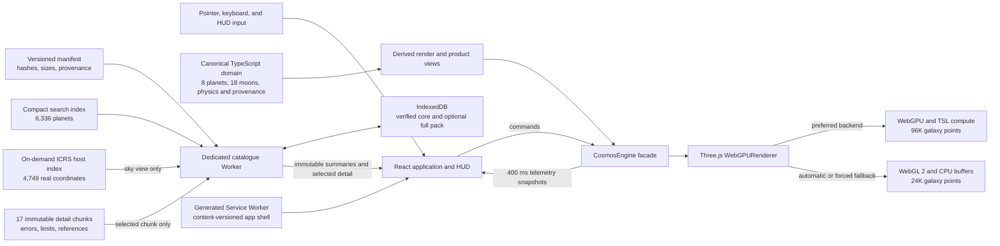

<div align="center">
  <a href="https://space-engine-web.vercel.app/" aria-label="Open Astral Surveyor">
    
  </a>

  <h1>Astral Surveyor</h1>

  <p><strong>A clean-room WebGPU universe explorer built with React, TypeScript, and Three.js.</strong></p>
  <p>Explore a deterministic procedural system, inspect a source-backed complete exoplanet research archive, tune the visual observatory, and fall back gracefully to WebGL 2 when WebGPU is unavailable.</p>

  <p>
    <a href="https://space-engine-web.vercel.app/"></a>
    <a href="https://github.com/tianrking/SpaceEngine-Web"></a>
    <a href="https://github.com/tianrking/SpaceEngine-Web/actions/workflows/ci.yml"></a>
  </p>
</div>

<p align="center">
  <a href="https://space-engine-web.vercel.app/">
    
  </a>
</p>

## Overview

Astral Surveyor is a browser-based vertical slice for testing the engineering foundations of a large-scale universe explorer. The application renders a deliberately compressed, visual-scale version of the fictional Asteria system and pairs it with a source-backed research catalogue of **6,336 confirmed exoplanets across 4,749 host systems**. It combines a GPU-initialized spiral starfield, eight planets, eighteen parent-relative moons, procedural surfaces, rings, cloud shells, atmospheric presentation, a cinematic scientific HUD, an interactive real-coordinate ICRS host atlas, visual calibration, live renderer telemetry, and an installable verified offline research pack.

The renderer and product UI now consume the same deterministic domain catalogue. That single source owns f64 Kepler mechanics, nested orbital hierarchy, SI inputs, equation-derived physical measurements, astronomical units, seeded procedural properties, provenance, and high/low precision helpers.

This project is an original clean-room implementation. It is not a port, fork, or web edition of SpaceEngine.

## Technology stack

<p align="center">
  
  
  
  
  
  
  
</p>

| Layer | Technology | Role in this repository |
| --- | --- | --- |
| Interface | React 19, Lucide React, CSS | HUD, object inspector, system navigator, time controls, quality presets, and responsive overlays |
| Language | TypeScript 6 | Typed engine contracts, simulation-domain code, UI, and build-time checks |
| Rendering | Three.js r185 `WebGPURenderer` | Scene graph, node materials, logarithmic depth, WebGPU selection, and WebGL 2 fallback |
| GPU programs | Three.js Shading Language (TSL) | WebGPU compute initialization for the spiral starfield and backend-compatible node materials |
| Procedural visuals | `simplex-noise`, Canvas textures | Seeded planet albedo, clouds, glows, rings, and small rocky-surface displacement |
| Astronomical data | NASA Exoplanet Archive TAP release | Versioned composite parameters for 6,336 confirmed exoplanets, a compact search index, a 4,749-host ICRS sky index, and 17 content-addressed scientific-detail chunks |
| Catalogue runtime | Dedicated Web Worker, Web Crypto, IndexedDB, immutable HTTP assets | Off-main-thread packed UTF-8 search, SHA-256/byte-size/schema verification, cancellable detail requests, bounded memory/disk caches, and an optional complete offline pack |
| Offline shell | Generated Service Worker | Atomically content-versioned application-shell precache and network-first navigation fallback without intercepting catalogue release validation |
| State boundary | React state plus engine snapshots | Commands flow into `CosmosEngine`; telemetry returns to React every 400 ms rather than every frame |
| Tooling | Vite 8, Oxlint | Development server, optimized production build, and static analysis |
| Tests | Vitest 4 | Deterministic catalogue, RNG, units, orbital mechanics, and precision-helper tests |
| Delivery | GitHub Actions, Vercel | `Quality Gate` CI and static Vite deployment |

WebAssembly is not currently used. The project first establishes correctness in TypeScript/f64 and will only move measured CPU hot paths to Rust/WASM if profiling justifies the added boundary and deployment complexity.

## Feature highlights

- **WebGPU-first rendering.** Three.js selects the WebGPU backend when available and initializes 96,000 spiral-galaxy points with a TSL compute pass.
- **Honest WebGL 2 fallback.** Unsupported or explicitly downgraded clients receive a 24,000-point CPU-generated galaxy while keeping the main navigation and inspection experience.
- **Seeded visual scene.** An additional 8,000 far stars and the procedural texture generators use repeatable pseudo-random sequences.
- **Interactive Asteria system.** Explore one G-class star, eight primary worlds, and eighteen selectable moons spanning lava, desert, ocean, super-Earth, Neptunian, gas-giant, ice-giant, dwarf, volcanic, rocky, icy, and oceanic classes.
- **Physics-derived catalogue.** Density, reference gravity, escape velocity, orbital period, mean orbital speed, periapsis, apoapsis, stellar flux, and equilibrium temperature are calculated from SI catalogue inputs instead of being independently hand-typed display values.
- **Hierarchical orbital simulation.** Planets follow deterministic Keplerian ellipses around Asteria; moons follow parent-relative orbits that are transformed into the star-system frame. Simulation time can pause or advance from `0.25x` to `10,000x` through the HUD.
- **Precision foundations.** The renderer recenters its floating origin beyond a fixed threshold. Separate, unit-tested high/low helpers are ready for future shader integration.
- **Procedural presentation.** Planets and moons include generated textures, class-aware terrain displacement, pressure-scaled atmosphere shells, cloud layers, ring geometry, stellar glow, and ACES filmic tone mapping.
- **Live visual observatory.** Tune tone-mapped exposure, orbital-guide brightness, and starfield brightness without rebuilding the scene or reallocating GPU geometry/material resources; versioned preferences persist locally.
- **Complete exoplanet archive.** Search all 6,336 confirmed planets in the pinned release by planet, host, spectral type, discovery method, or facility; combine Nearby, Earth-size, Temperate, and Recent filters and sort by name, distance, or discovery date.
- **Observed-host sky atlas.** Explore all 4,749 NASA host systems on an interactive high-DPI ICRS canvas using reported RA/Dec, distance, Gaia identity/magnitude, spectral type, multiplicity, and confirmed-planet count. Its 172 KiB gzip data asset and 3.3 KiB gzip UI chunk load only when requested; pointer and keyboard selection work, and composite-field conflicts remain visible instead of being resolved to a convenient value.
- **Scientific detail on demand.** The initial catalogue transfer is a compact 175 KiB gzip search index, including precomputed distance and discovery orders. Expanding a result fetches only one 78–153 KiB gzip detail chunk containing measurements, asymmetric errors, limit flags, source references, external IDs, discovery equipment, spectra/JWST counts, and stellar context.
- **Measured 100k search architecture.** A deterministic, explicitly synthetic 100,000-summary fixture runs in CI. The Worker search core stores normalized text in one UTF-8 byte buffer with typed offsets/orders instead of duplicating 100,000 JavaScript object forests; exact identity/name and mixed-filter p95 are both required to remain below 50 ms, while the auxiliary index must remain below 24 MiB.
- **Honest runtime telemetry.** The research panel reports packed-index CPU time separately from end-to-end verified readiness, which also includes network or IndexedDB loading, byte/hash/schema checks, and offline-state inspection.
- **Explicit data integrity.** Every immutable asset is checked against manifest byte size and SHA-256 before use. Missing source values remain `null`, composite fields stay labelled, stale detail requests can be cancelled, and only two decoded chunks remain in Worker memory.
- **Verified offline observatory.** After one successful online load, the generated Service Worker can restore the application shell and the Worker can restore the complete 6,336-planet search core from IndexedDB. An explicit 17-chunk research pack adds all scientific details for offline use; incomplete downloads never become the active complete pack, and the previous release pointer is retained for future recovery tooling.
- **Working product tools.** Search and filter all 27 bodies, inspect satellite families in the system map, save any destination locally, inspect the scientific/runtime model, and open an accessible keyboard guide.
- **Product-grade scientific HUD.** Switch between Overview, Physics, and Orbit tabs; inspect bulk properties, climate assumptions, atmospheric composition, conservative environment labels, provenance, and the live render pipeline.

## Scientific model and provenance

Astral Surveyor keeps two intentionally separate scientific layers:

- The rendered Asteria system is **fictional and deterministic**. Every body exposes provenance so curated scenario assumptions are distinguishable from equation-derived measurements.
- The Nearby Worlds archive contains **observational catalogue records** retrieved from the NASA Exoplanet Archive `pscomppars` table. These rows can combine preferred values from different literature sources, so the interface labels them **archive composite** and never presents missing values as measured facts.

- Reference conversions use the [IAU 2015 Resolution B3 nominal constants](https://www.iau.org/common/Uploaded%20files/IAUGA2015-Resolution-B3-recommended-nominal-conversion.pdf).
- World classes follow the broad terminology used by [NASA Exoplanet Exploration](https://science.nasa.gov/exoplanets/planet-types/).
- Internal values use SI units and JavaScript `number`/f64 precision.
- Climate and habitability labels are conservative exploration heuristics, not biosignature detections.
- Visual radii and orbital distances are compressed independently from the physical catalogue.
- The checked-in NASA release contains 6,336 unique planets in 4,749 host systems. Its metadata preserves the exact TAP query, source URL, retrieval time, release identity, content hashes, chunk boundaries, selection rule, conflict policy, and null policy. The host atlas is a map of confirmed-planet discoveries, not a statistically complete stellar census.

The equations, assumptions, input/derived boundary, and limitations are documented in [the scientific model](docs/SCIENCE_MODEL.md). The path from this implemented progressive NASA release to Gaia/SIMBAD/IVOA cross-matching and 100,000-summary scale is documented in the [real-catalog expansion roadmap](docs/CATALOG_EXPANSION.md).

## Current capability boundaries

The prototype is intentionally narrower than a production astronomical simulator.

| Area | What works now | Not implemented yet |
| --- | --- | --- |
| Scale | Floating-origin recentering and logarithmic depth in a compressed visual system | Physically scaled travel from planetary terrain to interstellar or galactic distances |
| Coordinates | f64 domain values, parent-relative moon transforms, tested high/low split utilities, and a verified ICRS RA/Dec atlas for all 4,749 observed NASA hosts | High/low shader integration, epoch propagation/proper-motion covariance, or hierarchical galaxy/system/planet navigation frames |
| Terrain | Fixed sphere meshes, seeded textures, and small CPU vertex displacement | Cube-sphere quadtree LOD, tile scheduling, geomorphing, collision, walking, or terrain-level landing |
| Atmosphere | Transparent additive shells and animated cloud presentation | Rayleigh/Mie scattering, precomputed atmosphere LUTs, volumetric clouds, weather, or physically based eclipses |
| Physics | Equation-derived bulk properties, stellar environment, and elliptic two-body Kepler motion | N-body gravity, perturbations, resonances, tidal evolution, relativistic trajectories, spacecraft dynamics, or aerodynamics |
| Data | Fictional deterministic Asteria plus a versioned 6,336-planet NASA release with content-addressed detail/host indexes, ICRS coordinates, uncertainties/limits, selected field references, external IDs, conflict flags, and honest nulls | Reviewed Gaia astrometry/cross-matches, SIMBAD aliases, authoritative ephemerides, full per-field reference coverage, observed atmospheres/terrain, or HEALPix spatial tiles |
| Universe generation | Seeded catalogue/RNG modules and on-demand procedural visual textures | Persistent sectors, billions of addressable objects, streaming catalogues, or generator-version migrations |
| Product UI | Inspector, system list, local simulated-body search, Worker-backed full exoplanet research search, interactive observed-host sky atlas, schematic Asteria map, `localStorage` saved places with memory fallback, visual calibration, runtime settings, shortcut guide, quality, cinematic, and time controls | Rendering and travelling through observed host systems, cloud sync, shared locations, user accounts, or server persistence |
| Platform resilience | Automatic WebGL 2 fallback, an explicit fallback route, a content-versioned offline app shell, verified IndexedDB search-core fallback, and an optional complete scientific-detail pack | GPU device-loss recovery, automatic catalogue rollback UI, cross-browser automated E2E coverage, or formal performance budgets |

The rendered Asteria catalogue is a physically constrained fictional scenario. Its derived values are internally consistent with the documented inputs, but they are not telescope observations. Visual radii and orbital distances are compressed for readability and must not be interpreted as a 1:1 scale model. The separate NASA research index is observational archive data and is not currently rendered as flyable systems.

## Controls

| Input | Action |
| --- | --- |
| Left-drag | Orbit around the current control target |
| Mouse wheel | Dolly toward or away from the target |
| Click a star, planet, moon, or ring | Select it and open its inspector |
| Double-click a star, planet, or moon | Fly to its orbital view |
| `G` | Focus the currently selected target |
| `/` | Open and focus the Asteria catalogue search |
| `?` | Open the keyboard shortcut guide |
| `Esc` | Close the active panel or dialog and return to Explore |
| `W` / `S` | Fly forward / backward |
| `A` / `D` | Fly left / right |
| `Q` / `E` | Fly down / up |
| Hold `Shift` | Apply a 4x keyboard-flight boost |
| `Space` | Pause or resume simulation time |
| **Go to orbit** | Fly to the selected body |
| **Close approach** | Move closer to the selected planet; this is not terrain landing |
| **Observation deck** | Reset the camera to the initial system view |
| Navigation rail | Open Explore, Search, Star map, Saved places, or Settings |
| Search source switch | Move between 27 rendered Asteria bodies and the progressive 6,336-record NASA research archive |
| Display calibration | Adjust exposure, orbit brightness, or starfield brightness; reset to the balanced observatory defaults |
| Time transport controls | Pause, resume, change the positive time scale, or reset the epoch |
| Quality selector | Switch between Performance, Balanced, and Ultra render resolution |
| Aperture button | Toggle cinematic mode and hide interface chrome |

## Quick start

### Prerequisites

- Node.js **22.12 or newer** is recommended; CI currently uses Node.js 22.
- A current browser with hardware acceleration. WebGPU is preferred; WebGL 2 is the compatibility path.
- `localhost` is accepted as a secure context for WebGPU. Public deployments must use HTTPS.

```bash
git clone https://github.com/tianrking/SpaceEngine-Web.git
cd SpaceEngine-Web
npm ci
npm run dev
```

Open the URL printed by Vite, normally <http://localhost:5173/>.

To exercise the fallback path explicitly, append `?renderer=webgl2`:

```text
http://localhost:5173/?renderer=webgl2
```

## Available scripts

| Command | Purpose |
| --- | --- |
| `npm run dev` | Start the Vite development server with hot module replacement |
| `npm run build` | Type-check project references, create the production bundle, and generate its content-versioned Service Worker |
| `npm run preview` | Serve the existing production bundle locally, normally on port 4173 |
| `npm run lint` | Run Oxlint across the project |
| `npm run test` | Run the regular Vitest unit suite once; the dedicated 100k scale gate is intentionally isolated |
| `npm run check` | Run lint, regular tests, the isolated 100k catalogue gate, and the production build in sequence |
| `npm run catalog:refresh` | Rebuild the complete manifest/index/chunk NASA release from the official TAP endpoint |
| `npm run catalog:benchmark` | Run the isolated, synthetic 100,000-summary catalogue scale gate and print its environment-labelled measurements |

For deterministic release-layout work without contacting NASA again, run
`npm run catalog:refresh -- --repack-existing`. This rebuilds the index,
precomputed sort orders, chunks, manifest, and generated release constants from
the checked-in detail records, preserving content-addressed filenames whenever
the inputs are unchanged.

## Architecture



The Three.js animation loop owns camera motion, hierarchical orbital updates, GPU resources, and per-frame rendering. React receives low-frequency snapshots for presentation, keeping reconciliation out of the render hot path. Display calibration mutates existing renderer uniforms/material properties in place. A Dedicated Worker owns NASA manifest/index validation, search, on-demand host-atlas loading, chunk loading, cancellation, memory/disk eviction, and atomic pack-readiness state; React receives at most the visible 20-result page plus one selected detail record. The host atlas draws 4,749 systems into one lazy-loaded Canvas rather than creating thousands of DOM nodes. IndexedDB stores only verified catalogue assets, while the generated Service Worker owns the application shell and deliberately leaves catalogue release validation to the Worker. The DOM-free simulation domain remains independent from both renderer and observed catalogue.

For deeper design notes, see [Architecture](docs/ARCHITECTURE.md) and [Research](docs/RESEARCH.md).

## Repository layout

```text
.
├── .github/workflows/ci.yml   # Quality Gate: npm ci + npm run check
├── docs/
│   ├── assets/                # README and product media
│   ├── ARCHITECTURE.md        # Engine boundaries and future terrain design
│   ├── CATALOG_EXPANSION.md   # Real-catalog sources, schema, streaming, and release gates
│   ├── SCIENCE_MODEL.md       # Inputs, derived equations, provenance, and limitations
│   └── RESEARCH.md            # Source-grounded SpaceEngine/WebGPU research
├── public/
│   ├── catalog/              # Immutable NASA manifest, search index, and detail chunks
│   └── ...                   # Favicon, web manifest, robots, and sitemap metadata
├── scripts/
│   ├── generate-service-worker.mjs                # Content-versioned offline-shell builder
│   └── refresh-progressive-exoplanet-catalog.mjs # Reproducible NASA release builder
├── src/
│   ├── components/            # Navigator, product tools, saved places, and shortcut dialog
│   ├── data/                  # Catalogue validators, Worker/client, search engine, and release constants
│   ├── domain/                # Canonical catalogue, physics, f64 orbits, RNG, units, precision
│   ├── engine/                # Three.js renderer, domain adapters, procedural textures
│   ├── pwa/                   # Production Service Worker registration boundary
│   ├── ui/                    # Reusable HUD components and styles
│   ├── App.tsx                # UI-to-engine orchestration
│   └── main.tsx               # React entry point
├── index.html                 # Vite document and SEO metadata
├── package.json               # Dependencies and scripts
├── vercel.json                # Immutable release caching and response security headers
└── vite.config.ts             # Vite React configuration
```

## WebGPU and WebGL 2 fallback

`CosmosEngine` constructs Three.js `WebGPURenderer` with antialiasing and a logarithmic depth buffer. At startup, Three.js attempts WebGPU first and uses its WebGL 2 backend when WebGPU cannot be initialized. The app reports the actual backend in the top status bar rather than inferring support from `navigator.gpu` alone.

| Mode | How to activate | Current star budget | Generation path |
| --- | --- | --- | --- |
| WebGPU | Default on a supported secure-context browser | 104,000 total: 96,000 galaxy + 8,000 far stars | TSL compute initializes galaxy position/color storage, plus CPU-seeded far stars |
| WebGL 2 | Automatic fallback or `?renderer=webgl2` | 32,000 total: 24,000 galaxy + 8,000 far stars | CPU-generated typed arrays rendered through Three.js's WebGL 2 backend |

The fallback preserves the product flow, not feature/performance parity. WebGPU compute, adapter details, supported limits, and visual throughput vary by browser, operating system, driver, and GPU.

## Local production preview

Build the same optimized output deployed by Vercel, then serve it locally:

```bash
npm run build
npm run preview
```

Open <http://localhost:4173/> or the address printed by Vite. `npm run preview` does not rebuild automatically; rerun `npm run build` after source changes.

## Testing and verification

Run the full local quality gate before opening a pull request:

```bash
npm run check
```

The unit suite currently verifies:

- deterministic seeded RNG streams and independent forks;
- the eight-planet and eighteen-moon catalogue, rings, nested lookup, and provenance;
- density, gravity, escape velocity, orbital speed, radiative equilibrium, flux, and conservative environment derivations;
- elliptic Kepler solving, orbital state, period derivation, and epoch periodicity;
- astronomical distance/speed formatting;
- camera-relative high/low precision splitting and reconstruction;
- display-setting normalization, persistence, and renderer calibration derivation; and
- NASA manifest/chunk/host-index hashes, schema, ICRS ranges, provenance, composite conflicts, uniqueness, null preservation, representative records, filters, sorting, and measured full-index search budget; and
- a clearly labelled synthetic 100,000-summary architecture gate covering exact identity/name search, mixed filters/orderings, and compact auxiliary-index storage.

Benchmark scope, methodology, current reference results, and non-claims are documented in [Performance](docs/PERFORMANCE.md). The 100k fixture validates engineering scale only; it is never exposed as observed catalogue data and does not satisfy the roadmap requirement for 100,000 reviewed real summaries.

GitHub Actions runs `npm ci` followed by `npm run check` for pull requests and pushes to `main`.

Browser behavior still requires a manual two-backend smoke test:

1. Open the default URL and confirm either **WebGPU active** or an honest **WebGL fallback** status.
2. Select and focus several bodies; verify orbit controls, keyboard flight, time controls, and telemetry.
3. Open `?renderer=webgl2` and confirm **WebGL fallback**, **CPU fallback**, and the reduced `32K` star count.
4. Check the console for shader, resource, and initialization errors.

There is no automated browser E2E or GPU performance test suite yet; Vitest passing is not evidence of cross-device rendering correctness.

## Deploy to Vercel

### One click

[](https://vercel.com/new/clone?repository-url=https%3A%2F%2Fgithub.com%2Ftianrking%2FSpaceEngine-Web)

Vercel detects the Vite project automatically. The current application has no required environment variables; the production build command is `npm run build` and the output directory is `dist`.

### Vercel CLI

```bash
npm ci
npx vercel
```

Accept the detected Vite defaults for a preview deployment. When the preview is verified, create a production deployment with:

```bash
npx vercel --prod
```

The public deployment for this repository is <https://space-engine-web.vercel.app/>.

## Roadmap

- [x] WebGPU-first Three.js renderer with an explicit WebGL 2 fallback
- [x] GPU-initialized galaxy, seeded far stars, procedural planets, clouds, and rings
- [x] Visual Asteria navigation, object inspection, time controls, and telemetry
- [x] Local search, schematic star map, saved places, runtime settings, and shortcut help
- [x] Deterministic f64 domain catalogue, Kepler mechanics, RNG, units, and precision tests
- [x] Drive renderer, search, map, and scientific Inspector from one canonical domain catalogue
- [x] Render selectable parent-relative moons and derive their physical/orbital profiles
- [x] Add persistent exposure, orbit-brightness, and starfield-brightness calibration without GPU resource churn
- [x] Replace the 128-record prototype with all 6,336 confirmed NASA planets in a reproducible, content-addressed progressive release
- [x] Move full-catalogue search, verified detail loading, cancellation, and bounded caching into a Dedicated Worker
- [x] Add a content-versioned offline shell, verified IndexedDB search-core fallback, and an explicit complete scientific-detail pack
- [x] Add a lazy, Worker-verified ICRS Canvas atlas for all 4,749 real NASA host coordinates
- [x] Document the staged 100+ to 100,000-object real-catalog architecture, provenance, rights, caching, and performance gates
- [x] Add a CI-enforced synthetic 100,000-summary search/memory gate backed by a compact UTF-8/typed-offset Worker index
- [ ] Add hierarchical coordinate frames and use high/low values in render shaders
- [ ] Build six-face cube-sphere quadtree terrain with screen-space error, seams, and tile budgets
- [ ] Add a Worker-backed low-LOD terrain provider for WebGL 2
- [ ] Implement physically motivated atmospheric scattering and eclipse/ring shadows
- [ ] Add release-reviewed Gaia/SIMBAD cross-matching and streamed catalogue tiles with per-field provenance
- [ ] Add GPU device-loss recovery, automated browser E2E, cross-device GPU budgets, and telemetry-backed regressions
- [ ] Evaluate Rust/WASM SIMD or threads only for profiled CPU bottlenecks

## Clean-room, trademark, and license notice

Astral Surveyor is an independent, original prototype. **SpaceEngine** is the name and trademark of its respective owner, Cosmographic Software LLC. This repository is not affiliated with, endorsed by, sponsored by, or derived from the SpaceEngine product. No SpaceEngine source code, shaders, proprietary assets, or internal data files are intentionally included.

The repository currently has **no `LICENSE` file**. Publication on GitHub does not by itself grant permission to use, copy, modify, or redistribute the code. Do not represent this project as MIT-licensed or otherwise open source unless and until the repository owner adds an explicit license.
