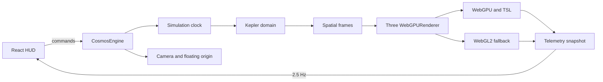

# Architecture

## Body-centered camera reference frames

Camera selection and camera centering are separate engine states:

- **Selected body** drives inspection and the next explicit navigation command.
- **Centered body** is the star, planet, or moon whose moving world-space origin is followed by the camera. System overview and Free flight have no centered body, but remain distinct camera states.
- `Orbit` and `Close` are presentation distances around the same body reference frame; neither is a terrain landing mode.

The animation order is deliberately `orbital update → centered-body translation → keyboard/flight update → floating-origin recenter → controls update → render`. After a centered body's parent-relative transform changes, the engine applies its world-center delta to both camera position and `OrbitControls.target`. Manual orbit/dolly input changes the relative pose but does not detach a completed tracked frame. A transition interrupted by manual input keeps the current pose instead of snapping to its destination and commits that pose as an explicit Free flight frame.

Previous View stores at most eight snapshots as camera and target offsets relative to each snapshot's center. Restoring a view resolves the center's current world position, so a saved moon view remains meaningful after the moon advances in its orbit. A restore is transactional: redirecting or cancelling it returns the popped destination to history, while pressing Previous again intentionally consumes it and continues to the next older frame. System overview is pushed like another reversible destination; destructive reset clears that history. Ringed bodies use an enclosing outer-ring radius for distance constraints. Reduced-motion preference selects zero-duration transitions, reacts immediately if the preference changes during flight, and removes its listener on engine disposal. Floating-origin shifts update every live camera anchor in the same local frame.

The implementation is backend-neutral camera/scene-graph logic and therefore follows the same path under WebGPU and WebGL 2. It is not an interstellar coordinate hierarchy: observed NASA catalogue systems remain research records and sky-atlas points, not flyable render scenes.

### Camera verification checklist

- Selected and Centered remain independent until an explicit Orbit or Close command.
- Star, planet, and parent-relative moon centers remain locked at high time scale while manual orbit/dolly preserves the relative view.
- Previous View restores up to eight immediate views; system overview is reversible, while reset clears history.
- Transition cancellation keeps the current pose without a destination snap.
- Free flight, system overview, and body-centered views remain distinct in engine telemetry and the HUD.
- Redirecting an in-progress Previous View does not lose its popped history destination.
- Ringed-body framing stays outside the outer ring; reduced-motion transitions complete immediately.
- Floating-origin recentering does not double-apply center movement or create a false velocity spike.
- WebGPU and WebGL 2 use the same camera-state behavior.

This checklist does not claim cube-sphere terrain landing, physically based Rayleigh/Mie atmospheres, N-body or spacecraft dynamics, or flyable observed NASA systems.

## 設計目標

首版是一個可測量的垂直切片，而非靠「畫很多球體」宣稱完成宇宙引擎。所有跨尺度能力都要能分開測試：數值模擬、空間參考系、渲染後端、程序生成、資源排程與 UI。

## 執行時資料流



Three.js 的 animation loop 不進 React state。相機、軌道可視物件、GPU buffers 與每幀 telemetry 留在 `CosmosEngine`；React 約每 400 ms 接收一次摘要，避免 reconciliation 進入 60 FPS hot path。

## 精度策略

1. simulation domain 使用 JavaScript `Number` / `Float64Array`。這已是 IEEE-754 f64。
2. GPU 的世界矩陣仍以 f32 為主，因此渲染採局部座標與 floating origin。
3. `src/domain/precision.ts` 提供 high/low 拆分，供未來星系 cell + camera-relative shader 使用。
4. logarithmic depth 改善深度 buffer 分布，但不被誤當成世界座標精度解法。
5. 後續將絕對位置表達為 `cellId(BigInt or integers) + local f64 offset`，而不是用 BigInt 計算軌道小數。

## 後端分層

```text
RendererAdapter
 ├─ WebGPUProvider
 │   ├─ TSL/WGSL compute
 │   ├─ storage buffers
 │   └─ GPU-resident generated tiles
 └─ WebGL2Provider
     ├─ CPU/Worker generated buffers
     ├─ reduced star count
     └─ bounded terrain LOD
```

Three.js 能把 `WebGPURenderer` 自動降級到 WebGL2，但 compute 的成本與限制不會因此完全等價。產品 UI 必須顯示實際後端，quality governor 也要選擇不同 budget。

## 地形 P1 設計

- 六個 cube-sphere faces，各自持有 quadtree。
- patch 使用固定 topology，共用 index buffer。
- screen-space error 決定 split/merge；horizon/frustum culling 優先於 tile 生成。
- 鄰接 LOD 差限制為一級，使用 skirts 或 edge stitching，並用 geomorph 控制 popping。
- tile scheduler 有 generation、upload、resident 三個 budget；離開視野的任務可取消。
- cache key 必須包含 `generatorVersion / seed / face / level / x / y`。
- WebGPU 結果盡量保持 GPU resident；避免每 tile readback。

## WASM 邊界

Rust/WASM 只在 profiling 後承接明確 CPU 熱點，例如：大批量 Kepler、catalog 解碼、CPU fallback terrain 或壓縮。WASM f64 不比 JS f64 更精確；它的價值是 SIMD、threads、可預測效能與既有數值程式碼重用。

## 驗收分層

- Source/build：TypeScript、lint、Vitest 與 production bundle。
- Browser：WebGPU/降級啟動、console、交互、視覺與 responsive。
- Performance：GPU 型號、解析度、後端、FPS、draw calls、resident tile budget。
- Science/data：catalog 來源、單位、epoch、誤差界與程序生成器版本。

任何單層通過都不應被描述成完整產品安全或科學準確性證明。
