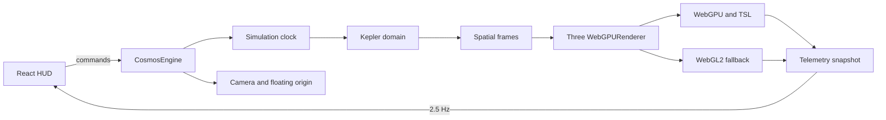

# Architecture

## Body-centered camera reference frames

Camera selection and camera centering are separate engine states:

- **Selected body** drives inspection and the next explicit navigation command.
- **Centered body** is the star, planet, or moon whose moving world-space origin is followed by the camera. System overview and Free flight have no centered body, but remain distinct camera states.
- `Orbit` and `Close` are presentation distances around the same body reference frame; neither is a terrain landing mode.

The animation order is deliberately `orbital update → centered-body translation → keyboard/flight update → floating-origin recenter → controls update → render`. After a centered body's parent-relative transform changes, the engine applies its world-center delta to both camera position and `OrbitControls.target`. Manual orbit/dolly input changes the relative pose but does not detach a completed tracked frame. A transition interrupted by manual input keeps the current pose instead of snapping to its destination and commits that pose as an explicit Free flight frame.

Previous View stores at most eight snapshots as camera and target offsets relative to each snapshot's center. Restoring a view resolves the center's current world position, so a saved moon view remains meaningful after the moon advances in its orbit. A restore is transactional: redirecting or cancelling it returns the popped destination to history, while pressing Previous again intentionally consumes it and continues to the next older frame. System overview is pushed like another reversible destination; destructive reset clears that history. Ringed bodies use an enclosing outer-ring radius for distance constraints. Reduced-motion preference selects zero-duration transitions, reacts immediately if the preference changes during flight, and removes its listener on engine disposal. Floating-origin shifts update every live camera anchor in the same local frame.

The implementation is backend-neutral camera/scene-graph logic and therefore follows the same path under WebGPU and WebGL 2. It is not an interstellar coordinate hierarchy: observed NASA catalogue systems remain research records and sky-atlas points, not flyable render scenes.

### Camera verification checklist

- Selected and Centered remain independent until an explicit Orbit or Close command.
- Star, planet, and parent-relative moon centers remain locked at high time scale while manual orbit/dolly preserves the relative view.
- Previous View restores up to eight immediate views; system overview is reversible, while reset clears history.
- Transition cancellation keeps the current pose without a destination snap.
- Free flight, system overview, and body-centered views remain distinct in engine telemetry and the HUD.
- Redirecting an in-progress Previous View does not lose its popped history destination.
- Ringed-body framing stays outside the outer ring; reduced-motion transitions complete immediately.
- Floating-origin recentering does not double-apply center movement or create a false velocity spike.
- WebGPU and WebGL 2 use the same camera-state behavior.

This checklist does not claim cube-sphere terrain landing, physically based Rayleigh/Mie atmospheres, N-body or spacecraft dynamics, or flyable observed NASA systems.

## Internationalization boundary

Internationalization is a presentation-layer concern and stays outside the simulation and rendering hot paths. `src/i18n/locale.ts` is the locale registry and declares the deterministic English default plus Spanish, Traditional Chinese, and French. With no valid stored preference, startup selects English; otherwise it selects the saved locale. `src/main.tsx` waits for that locale before mounting React, preventing a transient render in a different language.

The source-of-truth translations are typed authoring modules under `src/i18n/namespaces/`. `scripts/generate-i18n-packs.mjs` combines the `app`, `hud`, `tools`, and `nasa` namespaces and the typed `science` narratives into versioned `public/locales/<locale>.json` files. Each science section contains the complete authored description and facts for all 27 rendered Asteria bodies. Resource-parity tests require every locale to expose the exact English interface key set and canonical body-ID set with non-empty values.

In production, `src/i18n/localeLoader.ts` requests the selected `/locales/<locale>.json`, validates its pack version, locale identity, namespace shape, and science entries, and deduplicates concurrent requests. The active locale is the only translation payload required before React mounts and no locale is bundled into the initial JavaScript. Service Worker installation separately fetches English as the required offline fallback; unselected Spanish, Traditional Chinese, and French packs are not requested. A later selection loads its locale on demand and reuses the loaded pack for the remainder of the session. If a requested non-English pack cannot be loaded, initialization falls back to English; failure to load English is handled by the static startup error boundary.

Service Worker installation precaches `/locales/en.json` into `astral-locales-v<packVersion>` as the required offline boot fallback. Spanish, Traditional Chinese, and French are not install-time downloads. All `/locales/*.json` requests remain network-first: successful responses update the current-schema locale cache, and a previously used pack can satisfy the request when the network fails. That cache is retained across shell-only revisions; activation removes obsolete shell caches and any locale cache from an older pack schema. Installing the entry shell therefore guarantees an English locale fallback, not offline readiness for an unrequested non-English locale.

The Welcome screen and Settings panel both call the same asynchronous `setAppLocale` boundary. It loads the requested pack before changing i18next language and writing the versioned `astral-surveyor.locale` preference. `LocaleDocumentSync` then synchronizes `<html lang>`, document title, description, the localized web-manifest link, social metadata, and cross-tab `storage` events. Presentation components derive their `Intl.NumberFormat` and `Intl.DateTimeFormat` locale from the same registry, so visible values and accessibility labels change coherently.

Language changes cause React presentation updates only. They do not construct or dispose `CosmosEngine`, alter its animation loop, reset camera/simulation state, re-run WebGPU capability selection, or reallocate Three.js resources. The locale boundary is also independent from the progressive NASA catalogue client, verified immutable assets, Dedicated Worker, and observed-host atlas. Changing language does not restart that Worker, repeat the current catalogue query, or alter the catalogue's existing request-driven loading state.

These isolation claims are covered above the component boundary. `src/App.i18n.test.tsx` changes language and asserts that the same `CosmosEngine` construction and exact canvas node remain active; `src/components/ProgressiveNasaCatalog.i18n.test.tsx` asserts that the catalogue client is initialized only once. The global Vitest setup initializes English only, while locale-specific tests opt into other languages explicitly. Generated JSON packs are read and passed through the production `validateLocalePack` schema in `src/i18n/localeLoader.test.ts`, including the required 27 science entries.

Canonical scientific identity is also a boundary. Proper names, catalogue/host designations, chemical formulae, physical-unit symbols, source citations, and raw source-catalogue values are not translated. Application explanations, controls, status messages, metadata, and ARIA text are translated around those canonical values.

### Adding a locale

1. Extend `SUPPORTED_LOCALES` and `LOCALE_OPTIONS` in `src/i18n/locale.ts` with the locale key, native label, HTML language tag, and `Intl` locale.
2. Add the locale to the generator's locale list in `scripts/generate-i18n-packs.mjs`.
3. Add the complete locale tree to `src/i18n/namespaces/app.ts`, `hud.ts`, `tools.ts`, and `nasa.ts`, plus all canonical body entries in `src/i18n/namespaces/science.ts`, preserving interpolation names and scientific notation.
4. Add the localized web manifest and its registry metadata, then run `npm run i18n:generate` to refresh `public/locales`.
5. Verify startup loading, Welcome and Settings switching, local persistence, cross-tab synchronization, metadata/ARIA updates, long-label responsive layouts, number/date formatting, and the absence of requests for unselected locale packs.
6. Run the focused i18n tests and `npm run i18n:check`; the full `npm run check` quality gate includes the same committed-pack freshness check.

## Delivery and offline cache boundary

`scripts/generate-service-worker.mjs` reads the built `index.html` and precaches `/`, `/index.html`, the JavaScript and CSS assets referenced directly by that document, the favicon, the localized web manifests, and the required English locale pack. All built JavaScript/CSS/font assets, manifests, and locale packs contribute to the generated shell revision, but revision hashing does not make the non-shell files or the three optional locale packs install-time downloads.

Code-split runtime assets retain their request-driven boundaries. `CosmosEngine` is imported by the application after React mounts; the NASA catalogue client, Dedicated Worker, and observed-host atlas are loaded when their corresponding product paths request them. These chunks are not HTML module preloads and are not fetched during Service Worker installation. The Service Worker likewise bypasses `/catalog/nasa-exoplanets/`, leaving manifest validation, content hashes, IndexedDB storage, cancellation, and the optional complete research pack to the catalogue Worker.

This split minimizes install-time transfer and prevents the offline shell from silently downloading GPU or research features that the user has not opened. Its availability claim is deliberately bounded: the entry shell and English locale are precached, an on-demand locale can fall back after a prior successful request stored it in the current `astral-locales-v<packVersion>` cache, and verified NASA data can fall back through the Worker's IndexedDB path. The locale cache survives shell-only activation and is replaced only when the pack schema changes. The shell alone does not guarantee offline execution of uncached engine or NASA lazy chunks, or an unrequested non-English language.

## 設計目標

首版是一個可測量的垂直切片，而非靠「畫很多球體」宣稱完成宇宙引擎。所有跨尺度能力都要能分開測試：數值模擬、空間參考系、渲染後端、程序生成、資源排程與 UI。

## 執行時資料流



Three.js 的 animation loop 不進 React state。相機、軌道可視物件、GPU buffers 與每幀 telemetry 留在 `CosmosEngine`；React 約每 400 ms 接收一次摘要，避免 reconciliation 進入 60 FPS hot path。

## 精度策略

1. simulation domain 使用 JavaScript `Number` / `Float64Array`。這已是 IEEE-754 f64。
2. GPU 的世界矩陣仍以 f32 為主，因此渲染採局部座標與 floating origin。
3. `src/domain/precision.ts` 提供 high/low 拆分，供未來星系 cell + camera-relative shader 使用。
4. logarithmic depth 改善深度 buffer 分布，但不被誤當成世界座標精度解法。
5. 後續將絕對位置表達為 `cellId(BigInt or integers) + local f64 offset`，而不是用 BigInt 計算軌道小數。

## 後端分層

```text
RendererAdapter
 ├─ WebGPUProvider
 │   ├─ TSL/WGSL compute
 │   ├─ storage buffers
 │   └─ GPU-resident generated tiles
 └─ WebGL2Provider
     ├─ CPU/Worker generated buffers
     ├─ reduced star count
     └─ bounded terrain LOD
```

Three.js 能把 `WebGPURenderer` 自動降級到 WebGL2，但 compute 的成本與限制不會因此完全等價。產品 UI 必須顯示實際後端，quality governor 也要選擇不同 budget。

## 地形 P1 設計

- 六個 cube-sphere faces，各自持有 quadtree。
- patch 使用固定 topology，共用 index buffer。
- screen-space error 決定 split/merge；horizon/frustum culling 優先於 tile 生成。
- 鄰接 LOD 差限制為一級，使用 skirts 或 edge stitching，並用 geomorph 控制 popping。
- tile scheduler 有 generation、upload、resident 三個 budget；離開視野的任務可取消。
- cache key 必須包含 `generatorVersion / seed / face / level / x / y`。
- WebGPU 結果盡量保持 GPU resident；避免每 tile readback。

## WASM 邊界

Rust/WASM 只在 profiling 後承接明確 CPU 熱點，例如：大批量 Kepler、catalog 解碼、CPU fallback terrain 或壓縮。WASM f64 不比 JS f64 更精確；它的價值是 SIMD、threads、可預測效能與既有數值程式碼重用。

## 驗收分層

- Source/build：TypeScript、lint、Vitest 與 production bundle。
- Browser：WebGPU/降級啟動、console、交互、視覺與 responsive。
- Performance：GPU 型號、解析度、後端、FPS、draw calls、resident tile budget。
- Science/data：catalog 來源、單位、epoch、誤差界與程序生成器版本。

任何單層通過都不應被描述成完整產品安全或科學準確性證明。
