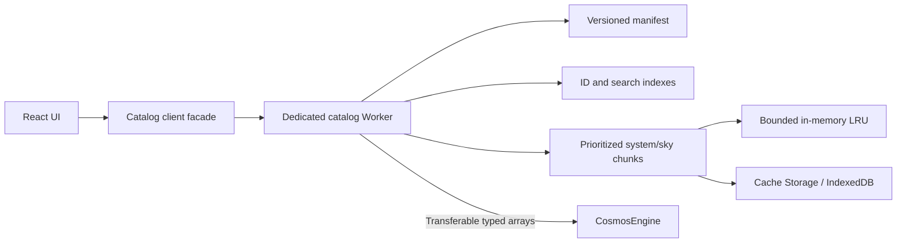

# Real-catalog expansion roadmap

> - Status: progressive NASA release implemented; Gaia/hierarchy/100k stages proposed
> - Research verified: 2026-08-11
> - Scope: expand Astral Surveyor from one deterministic fictional system to a
>   source-backed, progressively loaded catalogue while preserving the existing
>   renderer and synthetic-universe boundary.

## Executive decision

Build a **versioned catalogue product**, not a browser-side collection of live
API calls. A release pipeline should query authoritative services, retain an
immutable raw snapshot, normalize measurements without erasing units or
uncertainty, cross-match identities with auditable evidence, and publish
content-addressed chunks. The browser should receive only a small manifest,
search/index summaries, and the systems or sky cells needed by the current
view.

The three delivery stages are:

1. **Curated real core:** at least 100 observed/catalogued objects across many
   exoplanet systems, shipped as one reviewable offline pack.
2. **Hierarchy and progressive loading:** multiple-star systems, real galaxy
   anchors, relationship graphs, and system/HEALPix chunks loaded on demand.
3. **Production catalogue service:** incremental releases, binary columnar
   summaries, worker streaming, bounded caches, optional profiled WASM, and
   atomic offline updates at 100,000-summary-record scale.

This is deliberately not a promise to mirror all of Gaia or to infer missing
physics. An observed object, an archive-composite parameter, an equation-derived
value, and a procedural render assumption must remain visibly different facts.

## 1. Current baseline and migration constraints

The current domain is intentionally small and internally consistent:

- [`src/domain/types.ts`](../src/domain/types.ts) models one `StarSystem` with
  `star | planet | moon`, SI inputs, Keplerian orbits, and body-level
  `synthetic | catalogue | derived` provenance.
- [`src/engine/types.ts`](../src/engine/types.ts) exposes a flattened
  `CelestialBodyView` consumed by rendering, search, and the Inspector.
- [`SCIENCE_MODEL.md`](./SCIENCE_MODEL.md) correctly states that Asteria is a
  fictional deterministic scenario and not an observed exoplanet catalogue.
- [`public/catalog/nasa-exoplanets/manifest.json`](../public/catalog/nasa-exoplanets/manifest.json)
  now publishes all 6,336 confirmed planets returned by NASA `pscomppars` at
  retrieval time across 4,749 host systems. A compact search index and 17
  content-addressed detail chunks preserve honest nulls, asymmetric errors,
  limit flags, references, external IDs, discovery context, and reproducible
  TAP metadata. A separate content-addressed host index contains one ICRS
  RA/Dec record for each of the 4,749 exact NASA hostnames and drives a lazy
  high-DPI Canvas atlas. The release is inspectable and searchable but is not
  yet a canonical flyable-system graph.
- [`src/data/catalogOfflineStore.ts`](../src/data/catalogOfflineStore.ts) now
  persists only hash-verified release assets, atomically activates a verified
  search core, gates the optional 17-chunk detail pack behind a complete-pack
  marker, and retains the previous release pointer. The generated Service
  Worker separately precaches the versioned application shell.

The catalogue expansion must therefore preserve these invariants:

- Keep Asteria available as a synthetic demonstration namespace; never merge
  its identifiers or measurements into the observed namespace.
- Introduce a canonical observed-data model behind an adapter. Do not force the
  current render view to become the persistence schema.
- Keep physical values in f64 on the CPU and SI in simulation calculations,
  while preserving the source unit and raw value for audit.
- Keep render compression, missing-orbit visualization, palettes, terrain, and
  other procedural choices in a separate `render-assumption` layer.
- Represent a binary/circumbinary system with a barycentre and relationship
  graph. A single `parentId` is not sufficient for multi-star or probabilistic
  galaxy membership.

## 2. Authoritative-source policy

### 2.1 Source roles

| Source | Approved role | Important boundary |
| --- | --- | --- |
| NASA Exoplanet Archive | Confirmed exoplanets, host/system metadata, discovery data, orbital and bulk parameters | `ps` has one row per planet per literature reference; `pscomppars` has one more-complete row per planet but can combine non-self-consistent references. |
| ESA Gaia Archive | Release-scoped stellar identity, ICRS astrometry, proper motion, parallax, photometry, quality fields, covariance inputs, and selected non-single-star products | A Gaia source is an observed source record, not automatically a physical star or a stable cross-release identity. |
| SIMBAD | Name resolution, aliases, object type, bibliography, selected measurements, and curated hierarchy evidence | SIMBAD explicitly says it is a dynamic meta-compilation and **not a catalogue**; use it for enrichment and identity evidence, never as a statistically complete population. |
| IVOA/VO standards | TAP/ADQL querying, VOTable transport, units/UCD semantics, DataLink, and hierarchical sky coverage/index conventions | A protocol standard supplies interoperability, not scientific endorsement or dataset redistribution rights. |

### 2.2 NASA Exoplanet Archive ingestion rule

Use the official [TAP service documentation][nea-tap] and pin the query text.
For the curated release:

- Ingest `ps WHERE default_flag = 1` as the primary, internally coherent
  parameter row selected by the archive.
- Retain `pl_refname`, `st_refname`, `sy_refname`, `rowupdate`, and all selected
  uncertainty/limit columns.
- Use `pscomppars` only to fill an explicit **composite view**. Each imported
  composite field must retain its field-specific `*_reflink`, and its origin
  must be `archive-composite`, not `observed` or `derived-by-us`.
- Import `gaia_dr3_id`, `hd_name`, `hip_name`, and `tic_id` as external-ID
  evidence. The official [PS/PSCompPars column definitions][nea-columns]
  describe these identifiers, multi-star count `sy_snum`, circumbinary flag
  `cb_flag`, asymmetric errors, and limit flags.
- Never turn a missing longitude of ascending node, inclination, argument of
  periapsis, or epoch into an observed orbital element. A deterministic visual
  orientation may be generated, but only in `renderAssumptions`.

Do not use the retired Confirmed Planets API. The current official interface is
TAP over `ps` and `pscomppars`.

### 2.3 Gaia ingestion rule

Query the Gaia Archive through asynchronous TAP for batch work, following the
official [programmatic-access guide][gaia-programmatic]. The initial release
should select only Gaia rows linked to curated host/component candidates; it
must not download the full `gaiadr3.gaia_source` table.

The [Gaia DR3 `gaia_source` data model][gaia-source-model] establishes several
non-negotiable rules:

- `source_id` is a 64-bit integer and is unique only within a release. Store it
  in JSON and TypeScript as a decimal **string**, never a JavaScript `number`.
- The same astrophysical source can receive a different `source_id` in another
  release. Scope every ID by release and create an explicit cross-release match
  edge instead of overwriting it.
- Preserve `designation`, `solution_id`, `ref_epoch`, coordinate frame, and
  release. DR3 positions are ICRS at `ref_epoch`; the epoch uses Julian years in
  TCB according to the data model.
- Preserve formal errors and the astrometric correlation coefficients needed
  to construct a covariance matrix. A scalar error bar is not a replacement
  for correlated astrometry.
- Preserve quality context such as `astrometric_params_solved`,
  `visibility_periods_used`, RUWE where selected, and relevant known-issue
  flags. Do not invent a single universal "good Gaia row" cutoff.
- Do not calculate distance as `1 / parallax` for every row. Any distance
  estimator must be a separately versioned derived method with assumptions and
  reference.

Gaia bulk files are already partitioned by HEALPix ranges and include citation,
disclaimer, and checksum files; the official [extraction/bulk guide][gaia-bulk]
is useful input to the later chunking design. The product may choose different
client chunk sizes, but it should preserve source checksums and release tags.

### 2.4 SIMBAD ingestion rule

Use the official [SIMBAD service page][simbad-home] and [SIMBAD TAP
endpoint][simbad-tap]. The service exposes `basic`, `ident`, `h_link`,
measurement tables, bibliography, and `TAP_SCHEMA` metadata. Approved uses are:

- resolve display names and aliases through `basic.main_id` and `ident.id`;
- retain coordinate/object-type bibliography from `basic`;
- use `h_link` as evidence for a parent/child or membership candidate, including
  its bibliography and probability when present;
- use `mesDistance`, `mesPLX`, and other measurement tables only with their
  units, errors, quality, and bibcode;
- preserve the provider's internal `oid` only as a snapshot-local join key.
  It is not the product's durable public identifier.

SIMBAD says it is updated every working day and is heterogeneous by design.
Consequently, every extraction needs a timestamp/release label and raw hash;
changes are reviewed as a new snapshot rather than silently mutating installed
objects.

### 2.5 VO interoperability baseline

The pipeline should consume service metadata instead of hard-coding unverified
column meanings. The interoperability baseline verified on 2026-08-11 is:

| Concern | Standard |
| --- | --- |
| Query service and async jobs | [IVOA TAP 1.1][ivoa-tap] |
| Query language and spatial predicates | [IVOA ADQL 2.1][ivoa-adql] |
| Loss-minimizing table transport | [VOTable 1.5][ivoa-votable] |
| Unit strings | [VOUnits 1.1][ivoa-vounits] |
| Quantity semantics | [UCD principles][ivoa-ucd] and the [UCD1+ vocabulary][ivoa-ucd-list] |
| Related products | [DataLink 1.1][ivoa-datalink] |
| Hierarchical sky tiling | [HiPS 1.0][ivoa-hips] |
| Coverage manifests | [MOC 2.0][ivoa-moc] |

Pin the versions implemented by the ETL. At update time, compare the live
`TAP_SCHEMA.tables`, `TAP_SCHEMA.columns`, capabilities, units, and UCDs to the
saved schema snapshot. A provider adding a column is informational; a selected
column changing type/unit or disappearing is a failed build.

## 3. Canonical schema

### 3.1 Entity, relationship, and frame model

Use a graph with explicit reference frames:

```text
catalogue snapshot
├── galaxy / galaxy-group anchors
│   └── membership edges (possibly probabilistic)
├── stellar-system
│   ├── barycentre
│   ├── star component A
│   ├── star component B
│   └── planet -> orbit centre (star or barycentre)
└── source records, measurements, matches, and render assumptions
```

Recommended persisted TypeScript contract:

```ts
type EntityId = `astro:v1:${string}`

type EntityKind =
  | 'galaxy-group'
  | 'galaxy'
  | 'stellar-system'
  | 'barycentre'
  | 'star'
  | 'planet'
  | 'moon'

interface CatalogEntity {
  schemaVersion: 1
  id: EntityId
  kind: EntityKind
  primaryName: string
  externalIds: ExternalIdentifier[]
  aliases: CatalogName[]
  frameId: string
  astrometry?: AstrometricSolution
  measurements: Record<string, Measurement<unknown>>
  orbitSolutions: OrbitSolution[]
  relationshipIds: string[]
  renderAssumptionIds: string[]
  lifecycle: 'active' | 'disputed' | 'retired' | 'merged'
  sourceRecordIds: string[]
}

interface CatalogRelationship {
  id: string
  subjectId: EntityId
  predicate:
    | 'component-of'
    | 'orbits'
    | 'member-of'
    | 'same-as-candidate'
    | 'supersedes'
  objectId: EntityId
  probability?: number
  provenanceRef: string
}

interface SpatialFrame {
  id: string
  parentFrameId: string | null
  originEntityId: EntityId | null
  frame: 'ICRS' | 'galactocentric' | 'local-barycentric'
  epoch?: Epoch
  transformProvenanceRef: string
}
```

`stellar-system`, `barycentre`, and `star` are separate nodes. This permits
S-type planets, P-type/circumbinary planets, unresolved sources, and future
hierarchical triples without abusing a display name as a physical centre.
Galaxy membership is an edge, not a required tree parent, because membership
can be uncertain or literature-dependent.

### 3.2 Stable identifiers and aliases

Internal IDs follow these rules:

1. Mint an opaque `astro:v1:*` ID once and retain it in an identity ledger.
   Do not derive it solely from a mutable display name or sky position.
2. Scope every external identifier by namespace and release.
3. Preserve the exact provider string; keep a second normalized search key.
4. Never recycle an internal ID. Merges and splits become `supersedes` edges
   plus tombstones.

```ts
interface ExternalIdentifier {
  namespace: 'nasa-exoplanet-archive' | 'gaia' | 'simbad' | string
  release: string | null
  value: string
  normalizedSearchKey: string
  role: 'primary' | 'alias' | 'crossmatch-evidence'
  provenanceRef: string
}

interface CatalogName {
  value: string
  language?: string
  kind: 'catalogue' | 'proper' | 'component' | 'display'
  provenanceRef: string
}
```

Examples of valid external keys are release-scoped Gaia designations, NASA
planet/host names tied to a table snapshot, and SIMBAD identifiers tied to a
SIMBAD snapshot. Exact IDs take precedence over fuzzy names in search and
cross-match.

### 3.3 Measurements, units, limits, and uncertainty

Every scientific scalar must carry enough information to answer: "what was
reported, in which unit, with what uncertainty or limit, at what epoch, and by
whom?"

```ts
interface Measurement<T> {
  value: T | null
  nullReason?: 'unknown' | 'not-applicable' | 'not-published' | 'rejected'
  sourceUnit: string | null
  canonical?: { value: number; unit: string }
  ucd?: string
  constraint: 'measurement' | 'upper-limit' | 'lower-limit' | 'interval'
  uncertainty?:
    | { kind: 'symmetric'; sigma: number; unit: string }
    | { kind: 'asymmetric'; plus: number; minus: number; unit: string }
    | { kind: 'confidence-interval'; low: number; high: number; level: number }
    | { kind: 'covariance'; covarianceRef: string }
  epoch?: Epoch
  origin:
    | 'reported'
    | 'archive-composite'
    | 'derived'
    | 'assumed'
    | 'synthetic'
  methodRef?: string
  provenanceRef: string
}

interface Epoch {
  value: number | string
  representation: 'jyear' | 'mjd' | 'iso-8601'
  timeScale: 'TCB' | 'TDB' | 'TT' | 'UTC' | 'unspecified'
}
```

Normalization policy:

- Use VOUnits labels on import and canonical SI for physics. Preserve raw
  source text/value in the immutable staging snapshot.
- Normalize an asymmetric lower uncertainty to a positive magnitude in the
  canonical model, but retain the raw signed column and transformation log.
- Preserve NASA `*lim` information as a constraint; a limit is not an ordinary
  error bar.
- Preserve Gaia standard errors and all correlations selected for epoch
  propagation in a covariance object.
- Never replace null with zero. Unknown orbital angles stay unknown.
- Attach `frame`, `epoch`, and time scale to coordinates. A bare `x/y/z` or
  `ra/dec` pair is not a portable measurement.
- Derived quantities identify their formula, constants release, input
  measurement IDs, code version, and uncertainty method. Recalculation creates
  a new derived record rather than overwriting a reported one.

### 3.4 Astrometry and orbit solutions

```ts
interface AstrometricSolution {
  frame: 'ICRS'
  epoch: Epoch
  ra: Measurement<number>
  dec: Measurement<number>
  parallax?: Measurement<number>
  pmRaCosDec?: Measurement<number>
  pmDec?: Measurement<number>
  radialVelocity?: Measurement<number>
  covarianceRef?: string
  quality: Record<string, number | string | boolean | null>
  provenanceRef: string
}

interface OrbitSolution {
  id: string
  centreEntityId: EntityId
  orbitingEntityId: EntityId
  model: 'keplerian-two-body' | 'visual-only' | 'other'
  epoch?: Epoch
  semiMajorAxis?: Measurement<number>
  period?: Measurement<number>
  eccentricity?: Measurement<number>
  inclination?: Measurement<number>
  longitudeAscendingNode?: Measurement<number>
  argumentPeriapsis?: Measurement<number>
  meanAnomaly?: Measurement<number>
  missingElements: string[]
  provenanceRef: string
}
```

An archive may report projected separation rather than a true semi-major axis;
the NASA definitions explicitly warn that `pl_orbsmax` can have different
meanings for microlensing or direct imaging. The ETL must preserve the semantic
subtype rather than feeding every value into the Kepler solver.

### 3.5 Field-level provenance

Body-level provenance is too coarse once a row combines NASA, Gaia, SIMBAD,
literature, and local derivation. Use references into an immutable provenance
table:

```ts
interface SourceRecord {
  id: string
  provider: string
  dataset: string
  release: string | null
  table: string | null
  sourceRowKey: string | null
  sourceUri: string
  queryHash: string
  retrievedAt: string
  rawArtifactSha256: string
  rowSha256: string
  bibcode?: string
  doi?: string
  licenseId: string
  acknowledgementId: string
}

interface MatchEvidence {
  id: string
  leftExternalId: string
  rightExternalId: string
  method:
    | 'provider-cross-id'
    | 'exact-identifier'
    | 'epoch-propagated-position'
    | 'manual-review'
  separationMas?: number
  matchEpoch?: Epoch
  combinedSigma?: number
  score?: number
  decision: 'accepted' | 'rejected' | 'ambiguous'
  evidenceSourceIds: string[]
  policyVersion: string
}
```

The release manifest must also record the ETL commit, schema version,
conversion-constants version, cross-match-policy version, generator version,
and every input artifact hash.

## 4. Cross-match and identity policy

Cross-match in decreasing order of trust:

1. **Provider-supplied cross-ID:** NASA `gaia_dr3_id` to release-scoped Gaia
   designation/source ID.
2. **Exact external identifier:** SIMBAD `ident.id`, HD/HIP/TIC identifiers,
   after namespace-aware parsing. Keep the original string as evidence.
3. **Epoch-propagated spatial match:** propagate positions to a common epoch,
   combine positional uncertainties/covariance, and record all candidates.
4. **Manual scientific review:** required for multiple plausible components,
   unresolved binaries, high proper-motion disagreements, or incompatible
   object types.

Never use nearest-neighbour alone as proof of identity. The positional policy
must be configuration-versioned and tested on positive and negative control
sets. Its radius is derived from combined uncertainty plus a reviewed systematic
floor; do not bake a single arcsecond threshold into application code.

Ambiguity is first-class:

- one NASA host can map to a Gaia unresolved source, several Gaia components,
  or no acceptable Gaia source;
- a Gaia release split/merge can create one-to-many cross-release candidates;
- `sy_snum > 1` and `cb_flag = 1` describe system context but do not identify
  each stellar component;
- a SIMBAD hierarchy/membership probability is evidence, not an unconditional
  orbit.

An ambiguous match remains visible in the curation report and is excluded from
automatic physical merging. The UI can still display the provider records as
separate entities.

## 5. ETL and validation pipeline

### 5.1 Pipeline stages


1. **Discover:** snapshot TAP capabilities and `TAP_SCHEMA`; record provider
   documentation versions and known-issue pages.
2. **Extract:** prefer VOTable to retain datatype/unit/UCD metadata. Use async
   TAP for batch queries, bounded retries with jitter, and provider-respectful
   concurrency. The production browser never queries upstream archives.
3. **Freeze:** store query text, response bytes, retrieval time, response
   metadata, and SHA-256 before transformation. Raw artifacts are append-only.
4. **Normalize:** validate encodings, null markers, numeric finiteness, units,
   ranges, limits, uncertainty direction, frame, and epoch.
5. **Cross-match:** create match candidates and evidence; never mutate source
   rows. Human decisions are data with reviewer/reason/timestamp, not comments
   hidden in a script.
6. **Curate:** resolve conflicts by documented precedence for each field, not a
   global provider ranking. Retain competing measurements when scientifically
   meaningful.
7. **Derive:** run versioned formulas only from accepted inputs. Propagate
   uncertainty where the model supports it; otherwise label it unavailable.
8. **Publish:** write manifest, notices, source registry, indexes, chunks, and
   tombstones; hash every file.
9. **Verify:** run structural, scientific, licensing, deterministic-build,
   performance, and offline-update suites before promotion.

### 5.2 Required automated validation

| Class | Build-stopping checks |
| --- | --- |
| Source schema | Selected table/column exists; datatype, unit, and UCD match the reviewed snapshot; query result is not an error document. |
| Identity | Internal IDs unique; external IDs unique within declared namespace/release rules; Gaia IDs round-trip as strings; no unreviewed ambiguous match is auto-merged. |
| Numbers | No NaN/Infinity; physical ranges checked by field; negative uncertainties rejected after normalization; limits preserved; significant precision is not fabricated. |
| Coordinates | Frame and epoch present; RA/Dec ranges valid; propagation uses covariance inputs when available; source and propagated coordinates both retained. |
| Graph | Orbit centre exists; forbidden self-edges rejected; orbital containment has no cycles; membership probabilities are bounded; tombstones resolve. |
| Provenance | Every published scientific field has `provenanceRef`; every derived field lists method and inputs; every render assumption is labelled. |
| Rights | Every source has a reviewed license/rights status and acknowledgement; incompatible or unresolved redistribution rights stop public packaging. |
| Reproducibility | Same pinned raw inputs and ETL commit produce byte-identical logical records and stable content hashes. |
| Regression | Golden objects cover single star, binary, circumbinary planet, high proper motion, asymmetric uncertainty, upper limit, missing orbit angles, galaxy, merge, and split cases. |

Science warnings are also release artifacts. For example, a new Gaia known
issue or a planet status change produces a review queue even when the schema and
download succeed.

## 6. Chunk, cache, and index architecture

### 6.1 Release layout

```text
catalog/<catalogRevision>/
├── manifest.json
├── notices.json
├── provenance/sources.json
├── core/entities.bin
├── indexes/external-id.bin
├── indexes/name-search.bin
├── indexes/system-directory.bin
├── indexes/coverage.moc
├── systems/<prefix>/<system-id>.bin
├── sky/Norder<k>/Dir<d>/Npix<p>.bin
├── galaxies/<galaxy-id>/manifest.json
└── tombstones.bin
```

Design rules:

- `manifest.json` is small JSON and names schema/catalog revisions, source
  snapshots, notices, compatible app versions, chunk hashes, sizes, and URLs.
- Chunk URLs include the catalog revision and content hash. They are immutable;
  a new release never overwrites old bytes.
- The core contains the 100+ curated object summaries and galaxy/system
  directory needed for a useful offline first view.
- Detail records are grouped by stellar system. Large sky populations use
  nested HEALPix cells following HiPS-style `Norder/Npix` addressing.
- A MOC file describes available sky coverage without enumerating every empty
  cell.
- A galaxy manifest defines the anchor, local frame, available LODs, and child
  spatial indexes. Real anchor metadata and procedural visual population remain
  separate chunks.
- Target compressed chunk size is 64-256 KiB; split before 512 KiB. Merge tiny
  adjacent cells to avoid request storms. These are product budgets, not IVOA
  requirements.

### 6.2 Indexes

Maintain three orthogonal indexes:

1. **Identity index:** exact `(namespace, release, value) -> EntityId`, with all
   64-bit IDs stored as strings.
2. **Search index:** normalized aliases and prefixes to entity summaries. Keep
   display spelling separate, support Unicode, and rank exact IDs above names.
3. **Spatial/hierarchy index:** HEALPix cell to summary range plus compact
   system/relationship adjacency lists.

For the curated core, sorted arrays and binary search are enough. At larger
scale, use a compact finite-state/prefix index or sorted columnar blocks; do not
instantiate a million-entry JavaScript object map on startup.

### 6.3 Browser data flow



- React receives immutable summaries and commands; it does not parse raw
  VOTable/binary chunks or enter the frame loop.
- A dedicated Worker owns fetch, validation, decode, indexes, coordinate
  propagation, and query cancellation. Send typed arrays with transfer, not
  cloned object forests.
- Use `AbortController` and a priority queue: selected object, visible cells,
  predicted camera path, then prefetch neighbours. Abandon stale fly-to work.
- HTTP content encoding handles compression. Stream response bodies to the
  Worker where the chosen decoder supports incremental input.
- Keep the last known-good decoded chunk until its replacement is fully
  validated. A partial response must never enter the engine.
- Rust/WASM is optional. Add it only after profiles show that binary decode,
  cross-match, epoch propagation, or decompression misses the budgets. WASM f64
  is not more precise than JavaScript f64.

### 6.4 Performance budgets

Test both a representative desktop WebGPU device and the project mobile/WebGL2
floor. Initial budgets:

| Metric | Budget |
| --- | --- |
| Bootstrap catalogue transfer | <= 300 KiB compressed, excluding app shell and textures |
| Individual data chunk | target 64-256 KiB; hard release limit 512 KiB compressed |
| Main-thread catalogue work | no task > 16 ms; catalogue steady-state <= 4 ms/frame |
| Worker core decode/index | p95 <= 100 ms desktop, <= 250 ms mobile floor |
| Exact-ID/name search over 100k summaries | p95 <= 50 ms after index ready |
| Selected system ready from warm disk cache | p95 <= 100 ms |
| Selected system ready on reference 10 Mbps/80 ms network | p95 <= 750 ms |
| Catalogue heap, excluding renderer assets | <= 64 MiB desktop, <= 24 MiB mobile |
| Background prefetch | zero requests while data-saver is active; at most 2 concurrent otherwise |

Performance tests must report fixture size, actual vs synthetic fixture status,
device/browser/backend, cold/warm cache, network profile, and percentiles. A
synthetic million-row stress fixture is acceptable for engineering tests but
must never appear in the product as observed data.

## 7. Offline, versioning, and update strategy

### 7.1 Version model

Do not compress all change dimensions into one version string:

```json
{
  "schemaVersion": 1,
  "catalogRevision": "YYYY-MM-DD.N",
  "sourceSnapshots": {
    "nasaExoplanetArchive": "retrieved-at + query-sha256",
    "gaia": "DR3 + archive/retrieval metadata",
    "simbad": "release-or-date + query-sha256"
  },
  "crossmatchPolicyVersion": "1.0.0",
  "derivationVersion": "1.0.0",
  "generatorVersion": "asteria-and-render-model-version",
  "minimumAppSchema": 1
}
```

Rules:

- Schema-breaking changes increment `schemaVersion` and ship a migration or a
  clean re-download path.
- Source refreshes increment `catalogRevision`, even if no UI field changes.
- A new Gaia data release is an explicit migration project. Do not silently
  replace DR3 IDs with a later release.
- Procedural generator changes never rewrite observational provenance.
- Retired/disputed planet rows and identity splits remain as tombstones so
  bookmarks can explain what changed.

### 7.2 Update cadence and promotion

- Run a scheduled **candidate** refresh weekly for NASA and SIMBAD, but publish
  only after schema, rights, scientific-diff, and golden-object review. Weekly
  is a project policy, not a claim about provider cadence.
- Monitor NASA `rowupdate`, Gaia release notes/known issues, and SIMBAD snapshot
  differences. A changed source row creates a field-level diff.
- Treat Gaia catalogue releases as pinned. Archive-software updates and known
  issues are monitored, but the data release changes only through a reviewed
  catalog revision.
- Produce a machine-readable change set: added, changed, retired, merged,
  split, rights-changed, citation-changed, and match-decision-changed.
- Promote `candidate -> stable` only after all gates pass. Retain at least the
  previous stable manifest/chunks for rollback.

### 7.3 Offline behavior

Implemented checkpoint (2026-08-12): the production build generates an
atomically versioned application-shell Service Worker; its cached HTML is never
mutated independently of the hashed JS/CSS assets. After a successful online
load, the catalogue Worker can recover the verified manifest/search core from
IndexedDB with the network disabled. Opening the sky atlas caches its separate
4,749-host ICRS index; the explicit research pack installs that index plus all
17 scientific-detail chunks. Every cached or downloaded asset is checked
against the manifest byte size, SHA-256 digest, and schema before it counts
toward pack readiness. The ready marker changes only after the complete pack is present, so
an interrupted installation remains resumable but inactive. Clearing the pack
removes application-managed detail records while preserving the search core.
The store retains the previous release pointer, but automated rollback
activation and its product UI remain future gates.

- Precache the app shell, manifest, notices, indexes, and curated core.
- Offer explicit optional packs by system, region, or galaxy. Show download
  size, source revisions, license/credit notice, and last verification date.
- Pin an offline session to one `catalogRevision`; never combine a new manifest
  with old unverified chunks.
- Download new content-addressed chunks into a staging cache, verify size/hash
  and schema, then atomically switch the active manifest pointer.
- If activation fails or storage quota is insufficient, keep the prior release
  and report a recoverable status. Evict unpinned LRU packs before pinned saved
  places.
- Expired data remains usable offline with a visible "snapshot from ..." label;
  the application must not pretend it is live.

## 8. Licensing, attribution, and citation gates

This section is an engineering policy, not legal advice. Dataset rights are
checked for every published release and may be stricter than software-source
licensing.

| Provider | Official statement to implement | Release gate |
| --- | --- | --- |
| NASA Exoplanet Archive | The archive provides required acknowledgement text, a current archive paper, dataset/service DOIs, and asks users to cite underlying literature references. See [acknowledgement guidance][nea-ack] and [DOI registry][nea-doi]. | Do not infer a blanket redistribution license from acknowledgement alone. Record dataset-specific rights; until reviewed, use `rightsStatus: review-required` for redistributed snapshots and always preserve literature references. |
| Gaia | DR3 has release-specific credit/citation instructions and required mission/release papers. See [DR3 credit instructions][gaia-credit]. The current [Gaia data-license page][gaia-license] states CC BY-NC 3.0 IGO and points commercial users to ESA terms. | Treat CC BY-NC 3.0 IGO as the conservative redistribution rule. Block commercial public packaging until ESA terms/legal review permit it. Store the exact license URL and retrieval date. |
| SIMBAD | The service page states ODbL use, requests acknowledgement/citation, and asks users to cite original literature. | Treat extracted/recombined database content as ODbL-governed pending review; ship attribution, source paper references, and any required share-alike database materials. Do not mix it into an incompatible closed data pack. |

There is a visible nuance in the Gaia official material: the DR3 credit page
also describes Gaia data as open/free with credit, while the current central
license page names a non-commercial license. The safe product decision is to
follow the more restrictive current license page and obtain clarification
before any commercial distribution.

Every release must include:

- `notices.json` with provider, dataset/release, license URL, retrieved date,
  acknowledgement template/version, citations, DOI/bibcode, and affected
  chunks;
- a human-readable **Data & credits** screen reachable online and offline;
- field-level source/reference links in the Inspector;
- a generated third-party data notice for downloadable packs;
- no provider imagery, logos, or thumbnails unless separately licensed.

A rights or citation change is release-significant even if data bytes are
unchanged.

## 9. Three-stage delivery roadmap

### Stage 1 — Curated 100+ real-object core

**Current checkpoint:** the complete progressive NASA composite release and
Worker-backed UI prove manifest-driven delivery, content-hash validation,
cancellable detail loading, bounded memory caching, source visibility, a
real-coordinate ICRS discovery atlas with explicit composite conflict flags,
verified offline search/core recovery, an explicitly installed full-detail
pack, and sub-50 ms full-index search. They do **not** satisfy every Stage 1
exit criterion: reviewed Gaia identity matches, full field-level reference
coverage, rights approval, automatic rollback activation, and real-system
rendering remain release gates.

**Goal:** prove source integrity and user value before distributed streaming.

Deliverables:

- canonical schema, source registry, match ledger, and current
  `CelestialBodyView` adapter;
- pinned NASA `ps default_flag=1` extraction for a reviewed host/planet set;
- Gaia DR3 enrichment through exact provider cross-IDs;
- optional SIMBAD alias/bibliography enrichment only after the ODbL packaging
  gate is satisfied;
- at least 100 catalogued real entities across at least 20 stellar systems,
  including stars and confirmed planets;
- immutable raw snapshots, deterministic normalized JSON/binary core, exact-ID
  search, provenance display, data credits, and offline core cache;
- golden tests for units, asymmetric errors, limits, missing orbital elements,
  high proper motion, and cross-ID conflicts.

Exit criteria:

- >= 100 active real entities and zero performance-fixture/synthetic entities
  counted toward that number;
- 100% of published scientific fields have source unit, origin, and
  `provenanceRef`; 100% of numeric derived fields name inputs and method;
- 100% of Gaia IDs survive JSON round-trip byte-for-byte as strings;
- no unknown orbit element is rendered as observed; visual substitutions are
  labelled `assumed` or `synthetic`;
- all selected raw rows can be traced from UI field to query hash, row hash,
  reference, and source snapshot;
- byte-identical release output from the same raw inputs and ETL commit;
- bootstrap, worker, memory, and search budgets in section 6.4 pass;
- full offline load works with network disabled and retains credits/notices;
- rights gate is green for every redistributed byte.

### Stage 2 — Multi-star, multi-galaxy, on-demand hierarchy

**Goal:** replace the single-system tree assumption with navigable scientific
hierarchy and progressive loading.

Deliverables:

- `stellar-system`, `barycentre`, component-star, galaxy, and galaxy-group
  entities plus typed relationships;
- at least five reviewed multiple-star/circumbinary systems using NASA system
  flags, Gaia component/NSS evidence where appropriate, and SIMBAD/literature
  identity evidence;
- at least three real galaxy anchors with source-backed position/distance or
  redshift metadata and explicit uncertainty/reference;
- system chunks, HEALPix sky chunks, MOC coverage, name/ID/spatial indexes,
  priority loading, cancellation, and separate real-anchor/procedural-visual
  layers;
- hierarchical frames: galaxy anchor -> stellar-system barycentre -> local
  orbit frame, integrated with camera-relative rendering;
- optional regional offline packs and atomic manifest activation.

Exit criteria:

- navigate and inspect at least five multiple-star/circumbinary systems and
  three galaxies without flattening components into one star;
- every orbit points to an explicit centre; graph validation has zero forbidden
  containment cycles and zero dangling published edges;
- all probabilistic membership and ambiguous matches remain labelled and are
  not silently collapsed;
- cold start does not fetch all catalogue chunks; network trace proves only
  core/index plus demanded system/sky cells load;
- no compressed chunk exceeds 512 KiB and no stale fly-to request continues
  after cancellation;
- cross-galaxy navigation changes reference frames without f32 world-position
  jitter in the supported camera path;
- warm/cold-cache latency and heap budgets pass on desktop WebGPU and the
  mobile/WebGL2 floor;
- offline pack install/update/rollback is atomic under simulated interruption.

### Stage 3 — Production progressive catalogue

**Goal:** make catalogue scale independent of boot cost and release updates
safe enough for long-lived bookmarks/offline packs.

Deliverables:

- >= 10,000 scientifically reviewed detail entities and an architecture
  benchmark of >= 100,000 real summary records; a separate synthetic
  million-row fixture may be used only for stress testing;
- compact columnar summaries, streaming Worker decode, spatial/identity/search
  indexes, bounded memory/disk LRU, telemetry, and back-pressure;
- profile-driven WASM/SIMD only for demonstrated hot paths, with JS fallback
  and identical conformance vectors;
- incremental candidate ingestion, source/schema/rights monitoring, curated
  diff workflow, tombstones, merge/split migrations, and rollback;
- version-aware saved places and user-visible snapshot/change information;
- reproducible build attestation containing all input and output hashes.

Exit criteria:

- adding summary records does not increase bootstrap transfer beyond 300 KiB;
- exact-ID/name search over 100k summaries meets p95 <= 50 ms after index load;
- catalogue heap stays within 64 MiB desktop and 24 MiB mobile budgets while
  traversing a repeatable 30-system/three-galaxy route;
- request count, cancellation, and cache eviction remain bounded during rapid
  camera movement and data-saver mode performs no background prefetch;
- a forced mid-download failure leaves the previous release fully operational;
- a Gaia release migration test preserves old external IDs, saved-place
  explanations, match evidence, and tombstones;
- field-level provenance/rights completeness is 100%, with zero unlabeled
  synthetic or assumed measurements;
- production telemetry reports catalogue revision, cache status, chunk errors,
  decode percentiles, and fallback path without collecting user search text.

## 10. Explicit non-goals and risk register

### Non-goals for these three stages

- Mirroring the full Gaia archive in the web application.
- Claiming Gaia source records are all single physical stars.
- Treating SIMBAD as a statistically complete star/galaxy catalogue.
- Deriving unknown exoplanet orbit orientation and presenting it as observed.
- Mixing procedurally generated stars/terrain with source-backed entities under
  one provenance label.
- Browser-to-archive live queries as the normal production data path.
- Adopting WASM merely for novelty; the Worker and data layout come first.

### Highest risks and mitigations

| Risk | Mitigation |
| --- | --- |
| Cross-release identity drift | Release-scope external IDs, keep match edges/tombstones, and require reviewed Gaia migrations. |
| Composite parameters appear more certain than they are | Preserve field references/origin and expose competing/default solutions. |
| Incomplete orbit rendered as scientific truth | Separate `OrbitSolution` from versioned visual assumptions and label the UI. |
| License incompatibility in an offline combined database | Per-chunk rights registry, conservative gate, distributable source separation, and legal review. |
| Upstream schema/service change | Snapshot TAP metadata, fail closed on selected-column drift, retain last known-good raw/release. |
| Main-thread or memory regression | Worker ownership, transferable columnar data, LRU budgets, cancellation, and fixed scale tests. |
| Update corrupts offline state | Content-addressed staging, hash verification, atomic manifest pointer, and rollback retention. |
| Galaxy anchors imply simulated billions are observed | Separate anchor and procedural population chunks; never count generated members as catalogue objects. |

## 11. Release checklist

- [ ] Pinned source queries and `TAP_SCHEMA` snapshots committed to the data
      release inputs.
- [ ] Raw responses hashed, immutable, and reproducibly transformed.
- [ ] Source releases, retrieval times, units, UCDs, epochs, frames, errors,
      limits, and references retained.
- [ ] Cross-match ambiguity report reviewed; no nearest-neighbour-only merge.
- [ ] All Gaia 64-bit identifiers serialized as strings.
- [ ] Reported, archive-composite, derived, assumed, and synthetic fields are
      distinguishable in data and UI.
- [ ] System/galaxy graph and coordinate-frame validation passes.
- [ ] License, acknowledgement, DOI/bibcode, and offline notices approved.
- [x] Manifest/chunk hashes, schema compatibility, interrupted-pack readiness,
      and active/previous release pointers tested.
- [ ] Automatic previous-release rollback activation and recovery UI tested.
- [ ] Cold/warm network, Worker, main-thread, search, heap, WebGPU, and WebGL2
      budgets reported with device details.
- [x] Cached scientific detail keeps its source names, references, release
      identity, and credits visible with the network disabled.

## Official references

All source behavior or version statements above are grounded in the following
provider/standards pages. Their contents can change; each ETL release stores the
retrieval date and a documentation/schema snapshot.

### NASA Exoplanet Archive

- [TAP access and current table names][nea-tap]
- [`ps` and `pscomppars` definitions, identifiers, units, errors, and flags][nea-columns]
- [Archive acknowledgement and citation guidance][nea-ack]
- [Archive dataset/service DOI registry][nea-doi]

### ESA Gaia

- [Gaia Archive programmatic access][gaia-programmatic]
- [Gaia DR3 documentation][gaia-dr3]
- [Gaia DR3 `gaia_source` data model][gaia-source-model]
- [Gaia extraction and bulk-download partition/checksum guidance][gaia-bulk]
- [Gaia DR3 credits and citation instructions][gaia-credit]
- [Gaia data license][gaia-license]
- [Gaia Archive release notes][gaia-release-notes]
- [Gaia DR3 overview and known-issues entry point][gaia-known-issues]

### CDS/SIMBAD

- [SIMBAD scope, update cadence, ODbL statement, and acknowledgement][simbad-home]
- [SIMBAD TAP endpoint and service metadata][simbad-tap]
- [SIMBAD query methods and TAP guidance][simbad-query]
- [SIMBAD measurement-type documentation][simbad-measurements]

### IVOA/Virtual Observatory

- [TAP 1.1][ivoa-tap]
- [ADQL 2.1][ivoa-adql]
- [VOTable 1.5][ivoa-votable]
- [VOUnits 1.1][ivoa-vounits]
- [UCD Recommendation][ivoa-ucd]
- [UCD1+ controlled vocabulary 1.6][ivoa-ucd-list]
- [DataLink 1.1][ivoa-datalink]
- [HiPS 1.0][ivoa-hips]
- [MOC 2.0][ivoa-moc]

[nea-tap]: https://exoplanetarchive.ipac.caltech.edu/docs/TAP/usingTAP.html
[nea-columns]: https://exoplanetarchive.ipac.caltech.edu/docs/API_PS_columns.html
[nea-ack]: https://exoplanetarchive.ipac.caltech.edu/docs/acknowledge.html
[nea-doi]: https://exoplanetarchive.ipac.caltech.edu/docs/doi.html
[gaia-programmatic]: https://www.cosmos.esa.int/web/gaia-users/archive/programmatic-access
[gaia-dr3]: https://gea.esac.esa.int/archive/documentation/GDR3/
[gaia-source-model]: https://gea.esac.esa.int/archive/documentation/GDR3/Gaia_archive/chap_datamodel/sec_dm_main_source_catalogue/ssec_dm_gaia_source.html
[gaia-bulk]: https://www.cosmos.esa.int/web/gaia-users/archive/extract-data
[gaia-credit]: https://gea.esac.esa.int/archive/documentation/GDR3/Miscellaneous/sec_credit_and_citation_instructions/
[gaia-license]: https://www.cosmos.esa.int/web/gaia-users/license
[gaia-release-notes]: https://www.cosmos.esa.int/web/gaia-users/archive/release-notes
[gaia-known-issues]: https://www.cosmos.esa.int/web/gaia/dr3
[simbad-home]: https://simbad.cds.unistra.fr/simbad/
[simbad-tap]: https://simbad.cds.unistra.fr/simbad/sim-tap/
[simbad-query]: https://simbad.cds.unistra.fr/Pages/guide/sim-q.htx
[simbad-measurements]: https://simbad.cds.unistra.fr/Pages/guide/chG.htx
[ivoa-tap]: https://www.ivoa.net/documents/TAP/
[ivoa-adql]: https://www.ivoa.net/documents/ADQL/20231215/REC-ADQL-2.1.html
[ivoa-votable]: https://www.ivoa.net/documents/VOTable/
[ivoa-vounits]: https://www.ivoa.net/documents/VOUnits/
[ivoa-ucd]: https://www.ivoa.net/documents/UCD1+/20180527/REC-UCD1+-1.1.html
[ivoa-ucd-list]: https://www.ivoa.net/documents/UCD1+/
[ivoa-datalink]: https://www.ivoa.net/documents/DataLink/
[ivoa-hips]: https://www.ivoa.net/documents/HiPS/
[ivoa-moc]: https://www.ivoa.net/documents/MOC/
